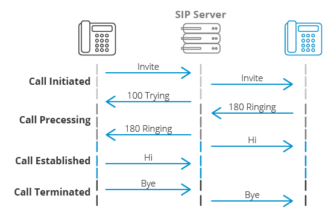

 

 
 

# AI14 - TZ - Mise en place d'une communication VoIP entre un Raspberry Pi et un téléphone IP

**Guillaume Nibert  
Encadrant : Dr. Ahmed Lounis**

## [Contexte](README.md)

## 1. Protocole SIP et communication VoIP

Les premières questions à se poser avant de démarrer la mise en place de cette infrastructure sont : qu’est-ce que la VoIP ? Qu’est-ce que le protocole SIP et quel est son rapport avec la VoIP ? Quel est le lien entre le protocole SIP et le protocole RTP ?

Pour répondre à la première question, il faut reprendre la pile d’Internet (suite des protocoles Internet).

<table>
    <thead>
        <tr>
            <th>Modèle OSI</th>
            <th></th>
            <th>Modèle TCP/IP</th>
        </tr>
    </thead>
    <tbody>
        <tr>
            <td>Application</td>
            <td rowspan=3></td>
            <td rowspan=3>SIP, HTTP, SMTP, FTP, RTP...</td>
        </tr>
        <tr>
            <td>Présentation</td>
        </tr>
        <tr>
            <td>Session</td>
        </tr>
        <tr>
            <td>Transport</td>
            <td></td>
            <td>UDP/TCP</td>
        </tr>
        <tr>
            <td>Réseau</td>
            <td></td>
            <td>IP</td>
        </tr>
        <tr>
            <td>Liaison</td>
            <td></td>
            <td>802.3 MAC, 802.11 MAC, EAP...</td>
        </tr>
        <tr>
            <td>Physique</td>
            <td></td>
            <td>802.3 PHY, 802.11 PHY, cuivre, fibre optique...</td>
        </tr>
    </tbody>
</table>

*(Figure 2 - Pile protocolaire de l'internet)*

VoIP signifie *Voice over Internet Protocol*, la voix est concrètement un signal analogique qui peut être acquis au moyen d’un microphone puis encodé numériquement via un convertisseur analogique → numérique. Une fois encodée, il est possible de faire passer la donnée dans la pile protocolaire de la suite des protocoles Internet. Dans ce schéma, il est donc possible de transférer la voix encodée via par exemple le protocole HTTP, transportée en TCP, dans un réseau IP via une liaison Ethernet vers un autre périphérique utilisant cette même pile protocolaire. Attention, tous les protocoles applicatifs ne sont pas forcément appropriés au transfert de voix encodées par exemple. Certains sont appropriés à pour réaliser de la communication en temps réel, par exemple la transmission de voix encodées (RTP), d’autres pour l’établissement d’une communication (SIP)...

SIP est le protocole permettant d’établir la communication entre des points de terminaison. Typiquement, un point de terminaison se comporte dans un premier temps comme un client SIP pour contacter un autre point de terminaison. Il interroge d’abord un serveur SIP qui lui fournit les informations sur l’identité de cet autre point de terminaison et comment y accéder dans le réseau IP. Une fois les informations reçues, la communication s’effectue directement entre les deux points de terminaisons via le protocole RTP (*Real-time Transport Protocol*). Ce dernier protocole transmet la voix encodée. Une fois la communication terminée, SIP reprend à nouveau le relais pour fermer la connexion (session).

*(Figure 3 - Établissement et fin de la communication - crédits : [3cx.fr](https://www.3cx.fr/voip-sip/sip/))*

Pour revenir à notre schéma, pour l’établissement d’une communication (par exemple Raspberry Pi appelle Alcatel) :

**a.** RPi envoie une demande de contact à Alcatel (Invite) en passant par Asterisk. Alcatel reçoit la réponse Invite, sonne et indique qu’il sonne à RPi. Quelqu’un décroche l’Alcatel, le contact est établi, donc...  
**b.** ...RTP prend le relais et transfère les voix entre les deux appareils en connexion directe (sans passer par Asterisk).

*(Figure 4 - Établissement d’une communication téléphonique entre le Raspberry Pi et le téléphone Alcatel IP Touch 4018 EE)*

Une fois la communication terminée (une personne raccroche), SIP se charge de fermer la session entre les deux participants.

## [2. Mise en place d'un serveur PABX IP Asterisk](2_ipbx_asterisk.md)

## [3. Installation et configuration d'un client SIP sur le Raspberry Pi](3_install_client_sip_rpi.md)

## [4. Configuration du téléphone IP](4_config_alcatel.md)

## [5. Tests de communication](5_tests_com_sip.md)

## [6. Client SIP JavaScript utilisant WebRTC](6_sip_webrtc.md)

## [Conclusion](Conclusion.md)

## [Sigles](Sigles.md)