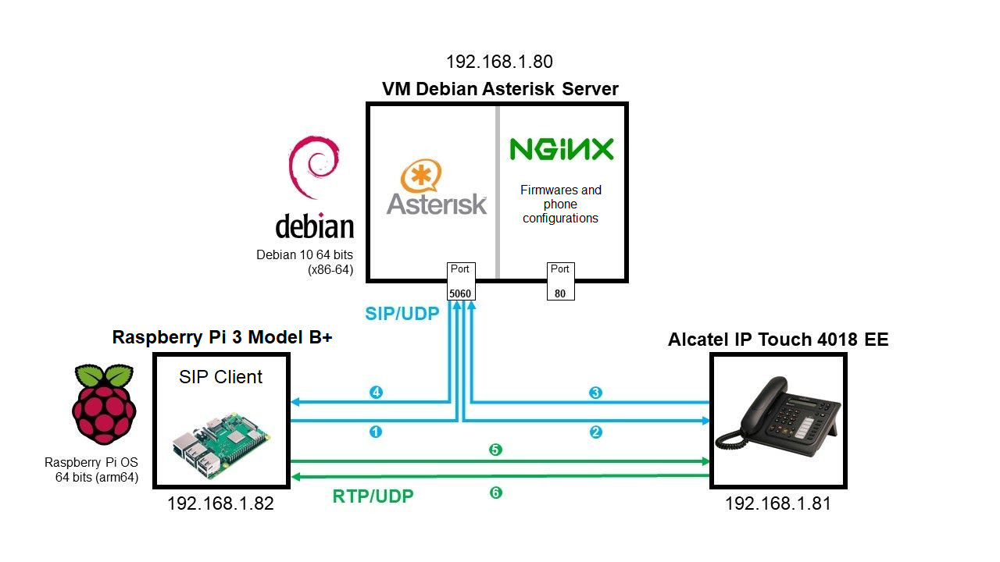

 

 
 

# Setting up a VoIP communication between a Raspberry Pi and an IP phone using an Asterisk IP PBX server

**Guillaume Nibert  
Supervisor: [Dr. Ahmed Lounis](https://www.hds.utc.fr/~lounisah/dokuwiki/)**

## [Context](README.md)

## 1. SIP protocol and VoIP communication

The first questions to ask before starting the implementation of this infrastructure are: What is VoIP? What is SIP and how does it relate to VoIP? What is the relationship between SIP and RTP?

Answering the first question requires understanding the internet stack (Internet protocol suite).

<table>
    <thead>
        <tr>
            <th style="min-width: 120px">OSI Model</th>
            <th></th>
            <th>TCP/IP Model</th>
        </tr>
    </thead>
    <tbody>
        <tr>
            <td>Application</td>
            <td rowspan=3></td>
            <td rowspan=3>SIP, HTTP, SMTP, FTP, RTP...</td>
        </tr>
        <tr>
            <td>Presentation</td>
        </tr>
        <tr>
            <td>Session</td>
        </tr>
        <tr>
            <td>Transport</td>
            <td></td>
            <td>UDP/TCP</td>
        </tr>
        <tr>
            <td>Network</td>
            <td></td>
            <td>IP</td>
        </tr>
        <tr>
            <td>Data link</td>
            <td></td>
            <td>802.3 MAC, 802.11 MAC, EAP...</td>
        </tr>
        <tr>
            <td>Physical</td>
            <td></td>
            <td>802.3 PHY, 802.11 PHY, cuivre, fibre optique...</td>
        </tr>
    </tbody>
</table>

    <i>(Figure 2 - Internet protocol stack)</i>

    VoIP stands for <i>Voice over Internet Protocol</i>, voice is specifically an analogue signal which can be acquired by means of a microphone and then digitally encoded using an analogue-to-digital converter. Once encoded, the data can be passed through the Internet protocol stack. In this diagram, it is therefore possible to transfer voice encoded using the HTTP protocol, transported in TCP, in an IP network via an Ethernet link to another device using this same protocol stack. Note that not all application protocols are necessarily suitable for transferring encoded voice. Some are suitable for real-time communication, e.g. transmission of encoded voice (RTP), others for establishing a communication (SIP)...

    SIP <i>(Session Initiation Protocol)</i> is the protocol that allows establishing a communication between endpoints. Typically, an endpoint initially acts as a SIP client to contact another endpoint. It first queries a SIP server which provides it with information about the identity of this other endpoint and how to access it in the IP network. Once the information has been received, communication takes place directly between the two endpoints via the <i>Real-time Transport Protocol</i> (RTP). This protocol transmits the encoded voice. Once the communication is over, SIP takes over again to close the connection (session). 

    <i>(Figure 3 - Establishment and termination of a VoIP communication using SIP - attribution: <a href="https://www.3cx.com/pbx/sip/" hreflang="en" target="_blank">3cx.com</a>)</i>

Going back to our very first diagram, for the establishment of a communication (e.g. Raspberry Pi calls Alcatel):

    <ol type="a" style="text-align: justify">
        <li>RPi sends a contact request to Alcatel (Invite) through Asterisk. Alcatel receives the Invite response, rings and indicates RPi that it is ringing. Someone picks up the Alcatel, the contact is established, so...</li>
        <li>...RTP takes over and transfers the voices between the two devices in direct connection (without going through Asterisk).</li>
    </ol>

*(Figure 4 - Établissement d’une communication téléphonique entre le Raspberry Pi et le téléphone Alcatel IP Touch 4018 EE)*

Once the call is over (one person hangs up), SIP takes care of closing the session between the two participants.

## [2. Implementation of an Asterisk IP PBX server](2_ipbx_asterisk.md)

## [3. Installation and configuration of a SIP client on the Raspberry Pi](3_install_client_sip_rpi.md)

## [4. IP phone configuration](4_config_alcatel.md)

## [5. Communication tests](5_tests_com_sip.md)

## [6. JavaScript SIP client using WebRTC](6_sip_webrtc.md)

## [Conclusion](Conclusion.md)

## [Abbreviations](Abbreviations.md)