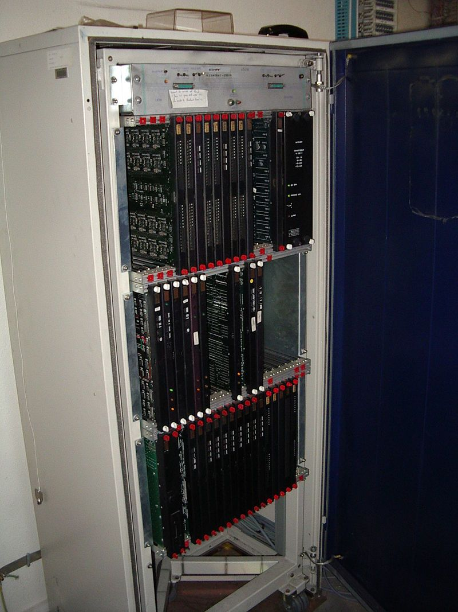
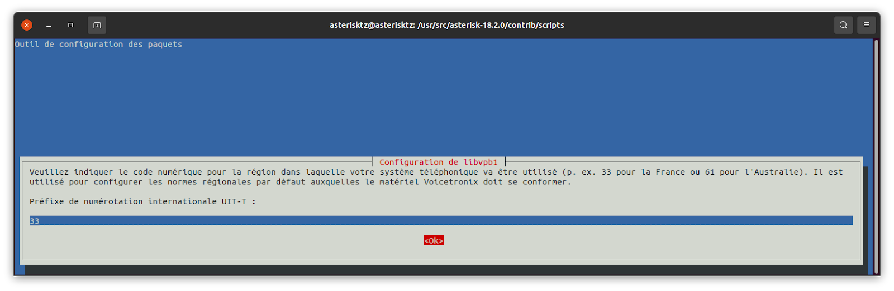
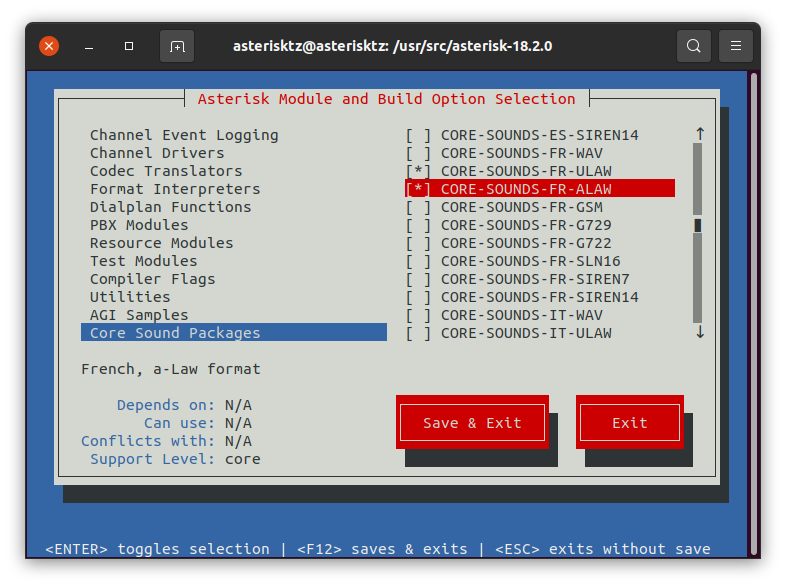
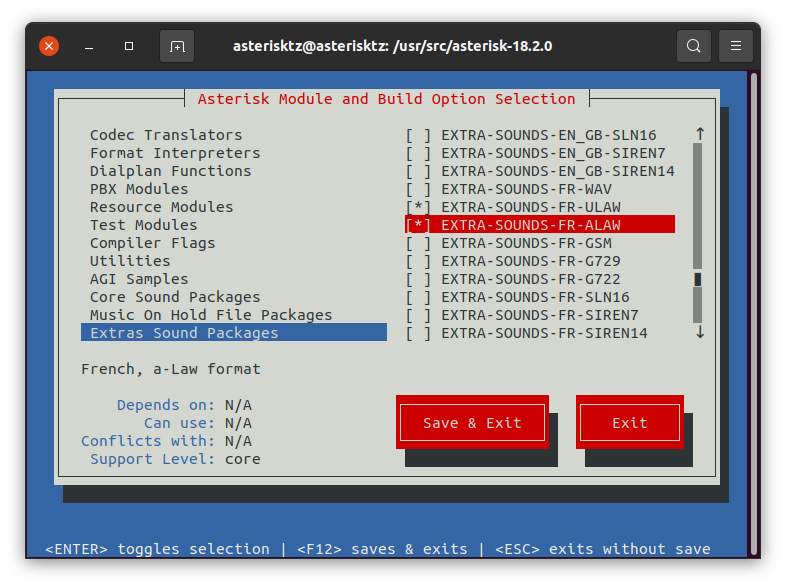
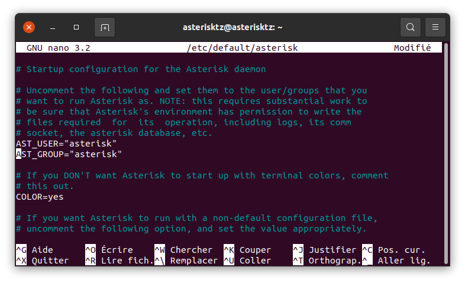
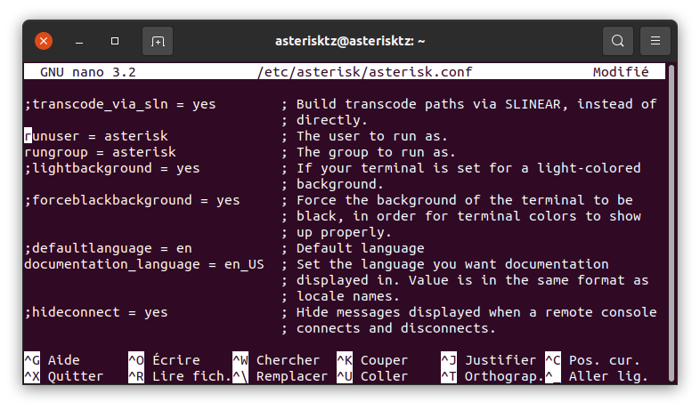
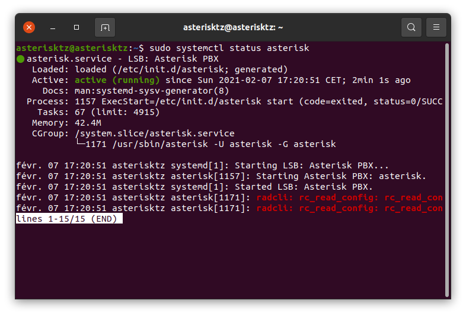
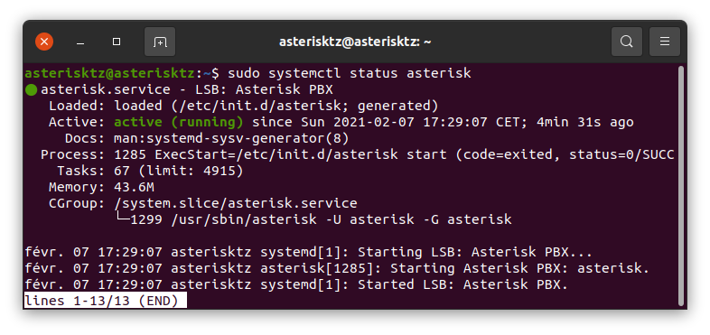

<div align="center">
<br>

<br>
<br>

# Setting up a VoIP communication between a Raspberry Pi and an IP phone using an Asterisk IP PBX server

**Guillaume Nibert  
Supervisor: [Dr. Ahmed Lounis](https://www.hds.utc.fr/~lounisah/dokuwiki/)**

</div>

## [Context](README.md)

## [1. SIP protocol and VoIP communication](1_sip_voip.md)

## 2. Implementation of an Asterisk IP PBX server

<p style="text-align: justify; text-indent:  3em;">
In large organisations (companies, public services, etc.), there are mainly two types of telephone communication: internal communication and external communication. The agents therefore have an internal fixed telephone capable of making calls to another internal fixed telephone or an external (public) telephone. For this to work, a PBX, also known as a Private Branch Exchange, is needed.
</p>
<p style="text-align: justify; text-indent:  3em;">
The PBX (below) has many advantages, including:
    <ul style="text-align: justify">
        <li>financially, the bill is reduced, as internal calls do not go through the public network (Orange, formerly France Telecom in France);</li>
        <li>more internal numbers can be allocated without difficulty;</li>
        <li>it is possible to offer services such as conference calls, call forwarding, call transfer;</li>
        <li>and, of course, linking an internal line to an external line.</li>
    </ul>
</p>

<div align="center">


<p style="text-align: center;">
    <i>(Figure 5 - PBX Matra MC6500 serie)</i><br>
<span style="font-size: 15px;">Attribution: <a href="https://commons.wikimedia.org/wiki/File:PABX_Matra6500.JPG" hreflang="en" target="_blank">the original uploader was After310 at French Wikipedia</a>, <a href="https://creativecommons.org/licenses/by-sa/3.0/deed.en" hreflang="en" target="_blank">CC BY-SA 3.0</a>, via Wikimedia Commons</span>
</p>

</div>

<p style="text-align: justify; text-indent:  3em;">
    A comprehensive list of the functions of a traditional PBX can be found on Wikipedia <b>(<a style="text-decoration: none;" href="#wikipedia_pabx" name="wikipedia_pabx_text">1</a>)</b>.
</p>
<p style="text-align: justify; text-indent:  3em;">
Now that the overall operation of this system has been presented, how can communication using SIP protocol be achieved? 
</p>
<p style="text-align: justify; text-indent:  3em;">
Historically, there have been three main phases in the evolution of telephone communications:
    <ol style="text-align: justify">
        <li>The public switched telephone network (PSTN) which is analogue. In this network, the SIP protocol cannot be used because SIP is a digital protocol.</li>
        <li>The Integrated Services Digital Network (ISDN) is a digital network whose network stack is based on the OSI model. Starting at Layer 3 (transport), the following protocols are used: Q.931 <b>(<a style="text-decoration: none;" href="#q931" name="q931_text">2</a>)</b>, X.25 layer 3 <b>(<a style="text-decoration: none;" href="#x253" name="x253_text">3</a>)</b>. Here it is Layer 3 which is problematic: SIP relies on IP to function.</li>
        <li>Voice over IP, over the Internet, is digital. SIP can work in this case. The associated PBX is an IP PBX (Internet Protocol private branch exchange).</li>
    </ol>
</p>

<p style="text-align: justify; text-indent:  3em;">
There are many IP PBXs in the world. Asterisk has the distinction of being the world's number one in terms of usage. It has a free version and a proprietary version. And it offers interoperability with older networks (PSTN and ISDN) by means of hardware cards and software modules. This last point is probably a major factor in its success: companies that still use old equipment, and that, in a perspective of modernisation, migrate to recent equipment, probably use several systems (PSTN, ISDN or VoIP), Asterisk will make it possible to manage these three systems simultaneously. 
</p>
<p style="text-align: justify; text-indent:  3em;">
So let's proceed with the installation of Asterisk.
</p>

## Technology choices

<p style="text-align: justify; text-indent:  3em;">
    <ul style="text-align: justify">
        <li>OS: Debian 10, it is free and is mainly used as a server in the computer world. It is a system with regularly updated packages in terms of stability and security.</li>
        <li>Asterisk: 18 LTS release compiled from source. The version in the Debian repositories is old (16 for Debian 10) and although it is also an LTS version, the fact that it is already compiled offers less flexibility in terms of adding modules. In addition, the module that handled SIP in the 16 release has been deprecated since the 17 release <b>(<a style="text-decoration: none;" href="#sip_deprecie" name="sip_deprecie_text">4</a>)</b> in favour of a new module (<a href="https://www.pjsip.org/" hreflang="en" target="_blank">PJSIP</a>) that can handle SIP as well as NAT traversal functions with SIP <b>(<a style="text-decoration: none;" href="#problematique_traversee_nat" name="problematique_traversee_nat_text">5</a>)</b>.</li>
    </ul>
</p>


## Prerequisite

<p style="text-align: justify; text-indent:  3em;">
Have an up-to-date Debian 10 machine (without GUI) connected to the local network and to the internet, also with SSH access (see appendix A1 of the PDF report for the detailed implementation of this prerequisite).
</p>
<p style="text-align: justify; text-indent:  3em;">
Consider in this section the following information from this machine:
</p>
<div align="center">

<table>
    <thead>
        <tr>
            <th>IP address</th>
            <th style="min-width: 110px">User</th>
            <th>Password</th>
        </tr>
    </thead>
    <tbody>
        <tr>
            <td rowspan=2>192.168.1.80</td>
            <td>asterisktz</td>
            <td>voiputc</td>
        </tr>
        <tr>
            <td>root</td>
            <td>voiputc</td>
        </tr>
    </tbody>
</table>

</div>

## Installation of Asterisk
*Note: the libraries allowing the management of telephone interface cards from Digium (the company maintaining Asterisk) and the management of protocols used in ISDN networks will not be installed.*

1. Connect via SSH to the `asterisk` machine.
<pre><span style="color:green;"># ssh login@vm_ip_address -p 22</span>
ssh asterisktz@192.168.1.80 -p 22
</pre>

2. Install the packages allowing the compilation of Asterisk and the prerequisites.
```bash
sudo apt update && sudo apt install linux-headers-$(uname -r) build-essential autoconf libglib2.0-dev libtool net-tools
```

3. Reboot the Debian machine and connect again via SSH.
```bash
sudo reboot
```
<pre><span style="color:green;"># SSH reconnection</span>
ssh asterisktz@192.168.1.80 -p 22
</pre>

4. Go to the directory `/usr/src` and download Asterisk 18 at this address: https://downloads.asterisk.org/pub/telephony/asterisk/asterisk-18-current.tar.gz. 

```bash
cd /usr/src
sudo wget https://downloads.asterisk.org/pub/telephony/asterisk/asterisk-18-current.tar.gz
```

5. Decompress the archive.
```bash
sudo tar -zxvf asterisk-18-current.tar.gz
```

6. Run the  `install_prereq` script installing the prerequisites. *Note: To find out the minor version number, type `ls`. In this report, it is Asterisk 18.2.*

```bash
cd asterisk-18.2.0/contrib/scripts/
sudo ./install_prereq install
```

<p style="text-align: justify;">
    During the installation of the prerequisites a window appears asking to select the telephone number code. Select <b><i>33</i></b> for France and validate with <code>&lt;Ok&gt;</code>. You can find an international list of area codes on this site: <a href="https://countrycode.org/" hreflang="en" target="_blank">https://countrycode.org/</a>.
</p>

<div align="center">


*(Figure 6 - Area code setting)*

</div>

7. Checking the required dependencies.

```bash
cd ../..
sudo ./configure
```
<p style="text-align: justify;">
If the operation is successful, you will get a message similar to this one with the Asterisk logo:
</p>

```
                .$$$$$$$$$$$$$$$=..      
              .$7$7..        .7$$7:.    
            .$7$7..           .7$$7:.
          .$$:.                 ,$7.7
        .$7.     7$$$$           .$$77
     ..$$.       $$$$$            .$$$7
    ..7$   .?.   $$$$$   .?.       7$$$.
   $.$.   .$$$7. $$$$7 .7$$$.      .$$$.
 .777.   .$$$$$$77$$$77$$$$$7.      $$$,
 $$$~      .7$$$$$$$$$$$$$7.       .$$$.
.$$7          .7$$$$$$$7:          ?$$$.
$$$          ?7$$$$$$$$$$I        .$$$7
$$$       .7$$$$$$$$$$$$$$$$      :$$$.
$$$       $$$$$$7$$$$$$$$$$$$    .$$$.
$$$        $$$   7$$$7  .$$$    .$$$.
$$$$             $$$$7         .$$$.
7$$$7            7$$$$        7$$$
 $$$$$                        $$$
  $$$$7.                       $$  (TM)
   $$$$$$$.           .7$$$$$$  $$
     $$$$$$$$$$$$7$$$$$$$$$.$$$$$$
       $$$$$$$$$$$$$$$$.

configure: Package configured for:
configure: OS type : linux-gnu
configure: Host CPU : x86_64
configure: build-cpu:vendor:os: x86_64 : pc : linux-gnu :
configure: host-cpu:vendor:os: x86_64 : pc : linux-gnu :
```
<p style="text-align: justify;">
If it went wrong, here is a link to the documentation: <br><a href="https://wiki.asterisk.org/wiki/display/AST/Checking+Asterisk+Requirements" hreflang="en" target="_blank">https://wiki.asterisk.org/wiki/display/AST/Checking+Asterisk+Requirements</a>.
</p>

8. Selecting the options to be installed for Asterisk. Ensure that the terminal is at least `80x27` in size.

```bash
sudo make menuselect
```
<p style="text-align: justify;">
A window appears allowing you to choose the options.
</p>

<p style="text-align: justify;">
Go to the Core Sound Package section to install the French sounds (or another language if you prefer):
    <ul style="text-align: justify;">
        <li>Deselect the <code>CORE-SOUNDS-EN-GSM</code>. These are the English sounds with the GSM audio codec.</li>
        <li>Select the <code>CORE-SOUNDS-FR-ULAW</code> and <code>CORE-SOUNDS-FR-ALAW</code>packages.These are the French sounds with ULAW and ALAW codecs (supported by the Alcatel IP Touch 4018EE <b>(<a style="text-decoration: none;" href="#alaw_ulaw_alcatel" name="alaw_ulaw_alcatel_text">6</a>)</b>). These codecs are defined by the ITU G.711 standard: <a href="https://www.itu.int/rec/T-REC-G.711-198811-I/en" hreflang="en" target="_blank">https://www.itu.int/rec/T-REC-G.711-198811-I/en</a>. The ALAW codec is used in Europe and Africa. The ULAW codec in North America and Japan <b>(<a style="text-decoration: none;" href="#alaw_ulaw_geo" name="alaw_ulaw_geo_text">7</a>)</b>.</li>
    </ul>


<div align="center">


*(Figure 7 - Selection of Asterisk sound modules)*

</div>

<p style="text-align: justify;">
Then in the Extra Sound Packages section, select the <code>EXTRA-SOUNDS-FR-ULAW</code> and <code>EXTRA-SOUNDS-FR-ALAW</code> packages.
</p>

<div align="center">


*(Figure 8 - Selection of Asterisk extra sound modules)*

</div>

Confirm by pressing the `F12` key.

9. Compile the program with the previously chosen options and install Asterisk.

```bash
sudo make
```
<p style="text-align: justify;">
The compilation takes time depending on the power of the machine. Once successful...
</p>

```
+--------- Asterisk Build Complete ---------+
+ Asterisk has successfully been built, and +
+ can be installed by running:              +
+                                           +
+                make install               +
+-------------------------------------------+
+--------- Asterisk Build Complete ---------+
```

...the installation of Asterisk can begin.

```bash
sudo make install
```

The installation ends with this message:

```
 +---- Asterisk Installation Complete -------+
 +                                           +
 +    YOU MUST READ THE SECURITY DOCUMENT    +
 +                                           +
 + Asterisk has successfully been installed. +
 + If you would like to install the sample   +
 + configuration files (overwriting any      +
 + existing config files), run:              +
 +                                           +
 + For generic reference documentation:      +
 +    make samples                           +
 +                                           +
 + For a sample basic PBX:                   +
 +    make basic-pbx                         +
 +                                           +
 +                                           +
 +-----------------  or ---------------------+
 +                                           +
 + You can go ahead and install the asterisk +
 + program documentation now or later run:   +
 +                                           +
 +               make progdocs               +
 +                                           +
 + **Note** This requires that you have      +
 + doxygen installed on your local system    +
 +-------------------------------------------+
```

10. Create the sample configuration files in the `/etc/asterisk` folder.

```bash
sudo make samples
```

11. Install the start-up scripts.

```bash
sudo make config
sudo ldconfig
```

12. Setting up the automatic start of the Asterisk service when the machine is launched.

```bash
cd
sudo groupadd asterisk
sudo useradd -r -d /var/lib/asterisk -g asterisk asterisk
sudo usermod -aG audio,dialout asterisk
sudo chown -R asterisk.asterisk /etc/asterisk
sudo chown -R asterisk.asterisk /var/{lib,log,spool}/asterisk
sudo chown -R asterisk.asterisk /usr/lib/asterisk
```

```
sudo nano /etc/default/asterisk
```

<p style="text-align: justify;">
    Uncomment the lines <code>AST_USER="asterisk"</code> and <code>AST_GROUP="asterisk"</code> (remove the <code>#</code> before each line). Save with <b><i>Ctrl + O</i></b>. Exit with <b><i>Ctrl + X</i></b>.
</p>

<div align="center">


*(Figure 9 - Setting `asterisk` as the default user of the Asterisk service)*

</div>

```bash
sudo nano /etc/asterisk/asterisk.conf
```

<p style="text-align: justify;">
    Uncomment the lines (remove the semicolon <code>;</code> before each line). Save with <b><i>Ctrl + O</i></b>. Exit with <b><i>Ctrl + X</i></b>.
</p>

```
runuser = asterisk ; The user to run as.
rungroup = asterisk ; The group to run as.
```

<div align="center">


*(Figure 10 - Setting `asterisk` as the default user of the Asterisk service)*

</div>

13. Start the Asterisk service

```bash
sudo systemctl start asterisk
```

You can now check its current status with the following command:

```bash
sudo systemctl status asterisk
```

<div align="center">


*(Figure 11 - Launch of the Asterisk service with errors)*

</div>

<p style="text-align: justify;">
    At this stage, if there are these two red lines, they can be corrected in this way (fix from <a href="https://www.clearhat.org/blog/post/a-fix-for-apt-install-asterisk-on-ubuntu-18-04" hreflang="en" target="_blank">https://www.clearhat.org/blog/post/a-fix-for-apt-install-asterisk-on-ubuntu-18-04</a>):
</p>


```bash
sudo systemctl stop asterisk

sudo sed -i 's";\[radius\]"\[radius\]"g' /etc/asterisk/cdr.conf

sudo sed -i 's";radiuscfg => /usr/local/etc/radiusclient-ng/radiusclient.conf"radiuscfg => /etc/radcli/radiusclient.conf"g' /etc/asterisk/cdr.conf

sudo sed -i 's";radiuscfg => /usr/local/etc/radiusclient-ng/radiusclient.conf"radiuscfg => /etc/radcli/radiusclient.conf"g' /etc/asterisk/cel.conf

sudo systemctl start asterisk
```

<div align="center">


*(Figure 12 - Launch of the Asterisk service without errors)*

</div>

14. Automatic start of the Asterisk service.

```bash
sudo /lib/systemd/systemd-sysv-install enable asterisk
```
<p style="text-align: justify;">
Asterisk is operational. Let's move on to user creation and SIP configuration!
</p>

### SIP configuration and user creation

<p style="text-align: justify; text-indent:  3em;">
    So we have an operational server, we must now configure SIP and create users. We will create 3 users with the following characteristics:
</p>

<div align="center">
<table>
    <thead>
        <tr>
            <th></th>
            <th>Alcatel phone</th>
            <th style="min-width: 50px;">Raspberry Pi</th>
            <th>Test</th>
        </tr>
    </thead>
    <tbody>
        <tr>
            <td>Purpose</td>
            <td>Dedicated account for the Alcatel IP Touch 4018 EE phone</td>
            <td>Dedicated account for the Raspberry Pi</td>
            <td>Dedicated account for testing</td>
        </tr>
        <tr>
            <td>Display name</td>
            <td>Alcatel IP Touch</td>
            <td>Raspberry Pi</td>
            <td>Guillaume Nibert</td>
        </tr>
        <tr>
            <td>Phone number</td>
            <td>5001</td>
            <td>5002</td>
            <td>5003</td>
        </tr>
        <tr>
            <td>Login</td>
            <td>alcaltel</td>
            <td>rpi</td>
            <td>guillaume</td>
        </tr>
        <tr>
            <td style="min-width: 100px;">Password</td>
            <td>11111111</td>
            <td>22222222</td>
            <td>33333333</td>
        </tr>
    </tbody>
</table>
</div>

<p style="text-align: justify;">
	There are two configuration files to edit:<code>pjsip.conf</code> and <code>extensions.conf</code>. The first one is used to create accounts, configure the operation of SIP (UDP/TCP), the authentication systems... and the second to define the behaviour of the system, more precisely the dialling plan (similar to routing if we were talking about IP packets). This "routing" is done according to telephone numbers (identifiers). These files are present in <code>/etc/asterisk</code> and in the <code>asterisk_sip</code> directory of the Git repository.
</p>

### SIP configuration - `pjsip.conf`

1. Rename the `pjsip.conf` configuration file to `pjsip_original.conf`.

```bash
sudo mv /etc/asterisk/pjsip.conf /etc/asterisk/pjsip_original.conf
```

2. Create a `pjsip.conf` file...

```bash
sudo nano /etc/asterisk/pjsip.conf
```

...and write the following content:
<pre>
conf
[transport-udp]
<span style="color:dodgerblue;">type</span>=transport
<span style="color:dodgerblue;">protocol</span>=udp
<span style="color:dodgerblue;">bind</span>=0.0.0.0
 
<span style="color:green;">; Basic templates, they will be copied for each user</span>
 
[endpoint_basic](!)
<span style="color:dodgerblue;">type</span>=endpoint         <span style="color:green;">; endpoint (phone/rpi/pc...)</span>
<span style="color:dodgerblue;">context</span>=plan-num      <span style="color:green;">; uses the dial plan defined in extensions.conf</span>
<span style="color:dodgerblue;">disallow</span>=all          <span style="color:green;">; disabling all audio codecs</span>
<span style="color:dodgerblue;">allow</span>=ulaw            <span style="color:green;">; except the ULAW codec</span>
<span style="color:dodgerblue;">allow</span>=alaw            <span style="color:green;">; and the ALAW codec</span>
<span style="color:dodgerblue;">language</span>=fr
 
[authentication](!)
<span style="color:dodgerblue;">type</span>=auth             <span style="color:green;">; type of section: authentication</span>
<span style="color:dodgerblue;">auth_type</span>=userpass    <span style="color:green;">; password authentication</span>
 
[aor_template](!)
<span style="color:dodgerblue;">type</span>=aor              <span style="color:green;">; find out where the endpoint can be contacted </span>
<span style="color:dodgerblue;">max_contacts</span>=1
 
<span style="color:green;">; Definitions of user accounts associated with equipment</span>
 
[alcatel](endpoint_basic)
<span style="color:dodgerblue;">auth</span>=alcatel
<span style="color:dodgerblue;">aors</span>=alcatel
<span style="color:dodgerblue;">callerid</span>=<span style="color:chocolate;">"Alcaltel IP Touch"</span> <5001> <span style="color:green;">; to have the name of the caller displayed</span>
[alcatel](authentication)
<span style="color:dodgerblue;">password</span>=11111111
<span style="color:dodgerblue;">username</span>=alcatel
[alcatel](aor_template)
 
[rpi](endpoint_basic)
<span style="color:dodgerblue;">auth</span>=rpi
<span style="color:dodgerblue;">aors</span>=rpi
<span style="color:dodgerblue;">callerid</span>=<span style="color:chocolate;">"Raspberry Pi"</span> <5002>
[rpi](authentication)
<span style="color:dodgerblue;">password</span>=22222222
<span style="color:dodgerblue;">username</span>=rpi
[rpi](aor_template)
 
[guillaume](endpoint_basic)
<span style="color:dodgerblue;">auth</span>=guillaume
<span style="color:dodgerblue;">aors</span>=guillaume
<span style="color:dodgerblue;">callerid</span>=<span style="color:chocolate;">"Guillaume Nibert"</span> <5003>
[guillaume](authentication)
<span style="color:dodgerblue;">password</span>=33333333
<span style="color:dodgerblue;">username</span>=guillaume
[guillaume](aor_template)
</pre>
<p style="text-align: justify;">
The creation of the accounts and the configuration of SIP is complete. Let's move on to the dial plan.
</p>

### Dial plan - `extensions.conf`

1. Rename the `extensions.conf` configuration file to `extensions_original.conf`.

```bash
sudo mv /etc/asterisk/extensions.conf /etc/asterisk/extensions_original.conf
```

2. Create an `extensions.conf` file...

```bash
sudo nano /etc/asterisk/extensions.conf
```

...and write the following content:

<pre>
conf
[plan-num]
<span style="color:dodgerblue;">exten</span> => 5001,1,Answer(500)
<span style="color:dodgerblue;">exten</span> => 5001,2,Dial(PJSIP/alcatel,25)
<span style="color:dodgerblue;">exten</span> => 5001,3,Hangup()
 
<span style="color:dodgerblue;">exten</span> => 5002,1,Answer(500)
<span style="color:dodgerblue;">exten</span> => 5002,2,Dial(PJSIP/rpi,25)
<span style="color:dodgerblue;">exten</span> => 5002,3,Hangup()
 
<span style="color:dodgerblue;">exten</span> => 5003,1,Answer(500)
<span style="color:dodgerblue;">exten</span> => 5003,2,Dial(PJSIP/guillaume,25)
<span style="color:dodgerblue;">exten</span> => 5003,3,Hangup()
 
<span style="color:green;">; 1, 2 and 3 correspond to the priorities of the Answer(),
; Dial() and Hangup() application calls. 1 being the highest priority.
; We can also write 1,n,n where the first n corresponds to 2 and the second
; to 3.
</span>
</pre>

<p style="text-align: justify; text-indent:  3em;">
"The <b><i>Answer()</i></b> application takes a delay (in milliseconds) as its first parameter. Adding a short delay is often useful to ensure that the endpoint has time to start processing the audio before starting the communication via the <b><i>Dial()</i></b> application. Otherwise, you may not hear the very beginning" <b>(<a style="text-decoration: none;" href="#extensions_conf" name="extensions_conf_text">8</a>)</b>. <b><i>Hangup()</i></b> as the name suggests hangs up the current call.
</p>
<p style="text-align: justify; text-indent:  3em;">
The dial plan is complete. The SIP accounts have been created. We can now proceed to the configuration of a SIP client on the Raspberry Pi.
</p>

## [3. Installation and configuration of a SIP client on the Raspberry Pi](3_install_client_sip_rpi.md)

## [4. IP phone configuration](4_config_alcatel.md)

## [5. Communication tests](5_tests_com_sip.md)

## [6. JavaScript SIP client using WebRTC](6_sip_webrtc.md)

## [Conclusion](Conclusion.md)

## [Abbreviations](Abbreviations.md)

## References on this page

<p><a name="wikipedia_pabx"></a><strong>(<a style="text-decoration: none;" href="#wikipedia_pabx_text">1</a>)</strong>: Wikipedia, <em>Business telephone system</em>, 21<sup>st</sup> january 2022, available at: <a href="https://en.wikipedia.org/wiki/Business_telephone_system" hreflang="en" target="_blank">https://en.wikipedia.org/wiki/Business_telephone_system</a>.</p>
<p><a name="q931"></a><strong>(<a style="text-decoration: none;" href="#q931_text">2</a>)</strong>: 
ITU Telecommunication Standardization Sector, <em>ISDN user-network interface layer 3 specification for basic call control</em>, ITU, May 1998, available at: <a href="https://www.itu.int/rec/T-REC-Q.931-199805-I/en" hreflang="en" target="_blank">https://www.itu.int/rec/T-REC-Q.931-199805-I/en</a>.</p>
<p><a name="x253"></a><strong>(<a style="text-decoration: none;" href="#x253_text">3</a>)</strong>: ITU Telecommunication Standardization Sector, <em>Interface between Data Terminal Equipment (DTE) and Data Circuit-terminating Equipment (DCE) for terminals operating in the packet mode and connected to public data networks by dedicated circuit</em>, ITU, October 1996, available at: <a href="https://www.itu.int/rec/T-REC-X.25-199610-I/en" hreflang="en" target="_blank">https://www.itu.int/rec/T-REC-X.25-199610-I/en</a>.</p>
<p><a name="sip_deprecie"></a><strong>(<a style="text-decoration: none;" href="#sip_deprecie_text">4</a>)</strong>: Matt Fredrickson, <em>PSA: chan_sip status changed to “deprecated” &amp; Asterisk 17.0.0-rc2 Release</em>, Asterisk.org, 25<sup>th</sup> september 2019, available at: <a href="https://www.asterisk.org/deprecating-chan_sip-asterisk-17-0-0-rc2-release/" hreflang="en" target="_blank">https://www.asterisk.org/deprecating-chan_sip-asterisk-17-0-0-rc2-release/</a>.</p>
<p><a name="problematique_traversee_nat"></a><strong>(<a style="text-decoration: none;" href="#problematique_traversee_nat_text">5</a>)</strong>: Y. Yeryomin, F. Evers and J. Seitz, <em>II. The NAT and firewall problem</em> <strong>In</strong>: <em>Solving the firewall and NAT traversal issues for SIP-based VoIP</em>, International Conference on Telecommunications, p.1-2, July 2008, DOI: 10.1109/ICTEL.2008.4652645, available at: <a href="https://www.researchgate.net/publication/224341038_Solving_the_firewall_and_NAT_traversal_issues_for_SIP-based_VoIP" hreflang="en" target="_blank">https://www.researchgate.net/publication/224341038_Solving_the_firewall_and_NAT_traversal_issues_for_SIP-based_VoIP</a>.</p>
<p><a name="alaw_ulaw_alcatel"></a><strong>(<a style="text-decoration: none;" href="#alaw_ulaw_alcatel_text">6</a>)</strong>: Alcatel-Lucent, <em>Audio characteristics</em> <strong>In</strong>: <em>Alcatel-Lucent IP Touch 4008/4018 Extended Edition Phones</em>, p.2, 2013, available at: <a href="https://assets.bmdstatic.com/assets/Data/brochure/SKU01413265_2.pdf" hreflang="en" target="_blank">https://assets.bmdstatic.com/assets/Data/brochure/SKU01413265_2.pdf</a>.</p>
<p><a name="alaw_ulaw_geo"></a><strong>(<a style="text-decoration: none;" href="#alaw_ulaw_geo_text">7</a>)</strong>: Wikipedia, <em>G.711</em>, 20<sup>th</sup> august 2021, available at: <a href="https://en.wikipedia.org/wiki/G.711" hreflang="en" target="_blank">https://en.wikipedia.org/wiki/G.711</a>.</p>
<p><a name="extensions_conf"></a><strong>(<a style="text-decoration: none;" href="#extensions_conf_text">8</a>)</strong>: Malcolm Davenport, <em>Answer, Playback, and Hangup Applications</em> <strong>In</strong>: <em>Asterisk Documentation</em>, Asterisk.org, 19<sup>th</sup> december 2013, available at: <a href="https://wiki.asterisk.org/wiki/display/AST/Answer%2C+Playback%2C+and+Hangup+Applications" hreflang="en" target="_blank">https://wiki.asterisk.org/wiki/display/AST/Answer%2C+Playback%2C+and+Hangup+Applications</a>.</p>