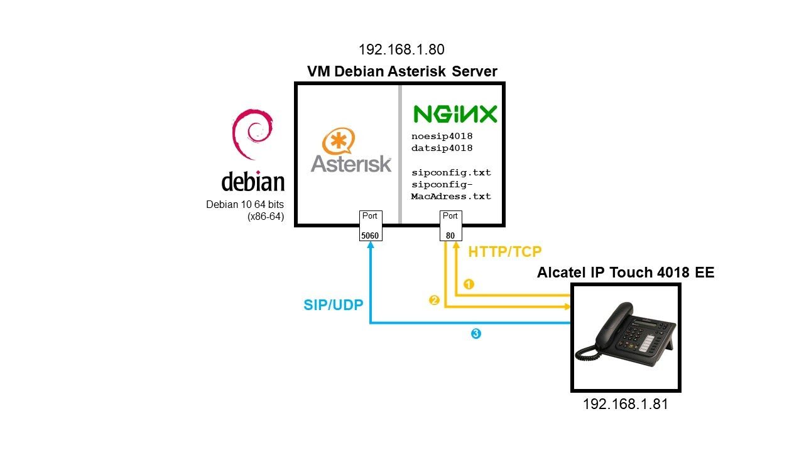
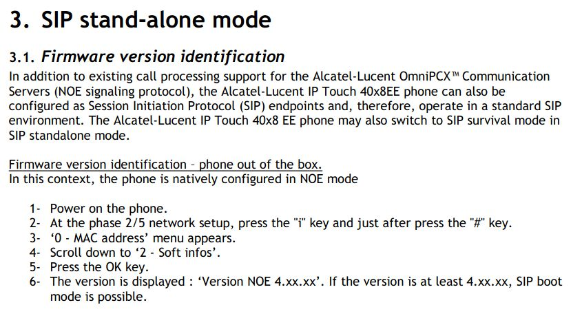
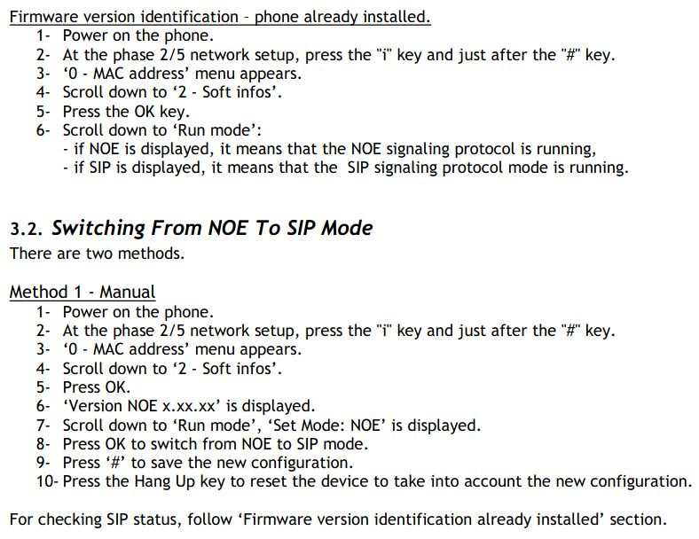

<div align="center">
<br>

<br>
<br>

# TZ - Mise en place d'une communication VoIP entre un Raspberry Pi et un téléphone IP


**Guillaume Nibert  
Encadrant : Dr. Ahmed Lounis**

</div>

## [Contexte](README.md)

## [1. Protocole SIP et communication VoIP](1_sip_voip.md)

## [2. Mise en place d'un serveur PABX IP Asterisk](2_ipbx_asterisk.md)

## [3. Installation et configuration d'un client SIP sur le Raspberry Pi](3_install_client_sip_rpi)

## 4. Configuration du téléphone IP

Le téléphone Alcatel IP Touch 4018 EE est un téléphone possédant deux modes de fonctionnement.
1. Le mode NOE (New Office Environment) : protocole de communication propriétaire développé par Alcatel/Lucent ;
2. Le mode SIP.

Il faut en premier lieu, le configurer en mode SIP. Ensuite, il a la particularité de se configurer automatiquement en téléchargeant automatiquement ses fichiers de configuration et ses fichiers de firmwares sur un serveur *TFTP*, *HTTP* ou *HTTPS* au moment du démarrage.

Parmi les trois protocoles, le plus sécurisé est l’*HTTPS*. Nous avons essayé de le mettre en place avec des certificats RSA 2048 bits et des *cipher suites* compatibles avec des équipements anciens. Malheureusement, étant en réseau local, le téléphone Alcatel semble ne pas accepter les certificats auto signés *(selon ce forum, il semble que les téléphones Alcatel IP Touch ne fassent confiance qu’à l’autorité de certification délivrée par l’entreprise Alcatel-Lucent. Le certificat racine issu d’Alcatel-Lucent semble se trouver au sein du téléphone : https://www.alcatelunleashed.com/viewtopic.php?t=28822. Nous n’avons pas les moyens d’obtenir un certificat à partir de l’autorité de certification d’Alcatel-Lucent)*. Compte-tenu de cette problématique, il ne reste que deux choix : *TFTP* ou *HTTP*. Ces protocoles applicatifs ne sont pas très sécurisés : pas d’authentification, transfert des données en clair sur le réseau... Le choix se fait donc au niveau des protocoles de transport : *TFTP* utilise nécessairement *UDP*, mode non connecté alors que *HTTP* peut être configuré pour utiliser *TCP*, mode connecté, qui intègre une détection et correction des erreurs. Les programmes transmis sont des firmwares, si des données sont corrompues à cause d’une erreur, cela pourrait bricker le téléphone. Privilégions donc le protocole *HTTP* associé au protocole *TCP*. Nous allons donc mettre en place un serveur *HTTP [NGINX](https://www.nginx.com/)* car léger, dont le seul but est de fournir les firmwares et les fichiers de configuration au téléphone Alcatel IP Touch. Il sera accessible à l’adresse ***192.168.1.80*** au niveau du port ***80***.

Bien évidemment, si cela est possible, pour une mise en production, nous recommandons d’utiliser *HTTPS*.

<div align="center">


*(Figure 13 - Récupération des fichiers de configuration du téléphone Alcatel via HTTP)*

</div>

### Informations sur la configuration

<div align="center">

| Adresse IP du téléphone Alcatel. Ceci est à configurer sur le routeur (cf. annexe A1.15 du rapport PDF). | 192.168.1.81       |
| ---------------------------------------------------------------------------------------------------------------------------------------------------------------------------------------------------------- | ------------------ |
| Adresse IP et port du serveur HTTP                                                                                                                                                                         | 192.168.1.80:80    |
| Alimentation PoE reliée au routeur                                                                                                                                                                         | [TP-Link TL-POE150S](https://www.tp-link.com/fr/business-networking/accessory/tl-poe150s/) |

</div>

### Configuration du téléphone en mode SIP - sur l'appareil

Brancher le téléphone à l’injecteur PoE puis suivre les instructions du manuel d’installation ci-dessous (captures d’écrans de la procédure).

<div align="center">



(Figure 14 - Alcatel-Lucent, *3. SIP stand-alone mode* **In** : *IP Touch 4008/4018 Extended Edition - SIP Phone Installation Guide - 8AL90824AAAA ed02*, p.4-5, Août 2010, Disponible sur : https://www.cluster2.hostgator.co.in/files/writeable/uploads/hostgator136107/file/iptouchsipphoneinstallationguide-ed02.pdf)

</div>

Une fois passé en mode SIP, il faut configurer l’adresse IP du téléphone afin qu’il soit en accord avec celui défini dans le routeur (**192.168.1.81**), il faut également lui fournir  l’adresse IP du serveur *HTTP* et son port.

1. Brancher le téléphone à l’injecteur PoE.
2. À la ***phase 2/5 network setup***, appuyer sur ***“i”*** puis sur ***“#”*** jusqu’à l'apparition du menu ***“MAC address”***.
3. S’il y a un mot de passe, entrer ***000000***.
4. Descendre jusqu’à ***IP Parameters***, puis cliquer sur ***OK***.
5. Descendre, puis sélectionner ***IP mode: Static***.
6. Descendre, puis entrer l’adresse IP : ***IP@: 192.168.1.81***
7. Descendre, puis entrer le masque de sous réseau : ***Subnet: 255.255.255.0***
8. Descendre, puis entrer l’adresse IP du routeur : ***Router: 192.168.1.254***
9. Descendre, puis sélectionner dans DL Scheme: ***HTTP***.
10. Descendre, puis sélectionner Use ***Defaultport***.
11. Descendre, puis sélectionner l’adresse du serveur *HTTP* : ***DL Addr: 192.168.1.80***
12. Descendre, puis sélectionner le port du serveur *HTTP* : ***DL Port: 80***
13. Descendre, ne pas sélectionner de *VLAN*.
14. Descendre jusqu’à sauvegarder ***save***, puis cliquer sur ***OK***.

La configuration sur l’appareil est terminée, cependant pour l’instant il ne va cesser de redémarrer en boucle puisque le serveur *HTTP* n’existe pas encore, ni les fichiers de configuration associés et les firmwares du téléphone.

### Installation du serveur HTTP

On va donc revenir sur notre machine virtuelle Debian et installer un serveur HTTP.

1. Se connecter en SSH à la machine `asterisktz`.

```bash
ssh asterisktz@192.168.1.80 -p 22
```

2. Installer le serveur HTTP ***nginx***.

```bash
sudo apt install nginx
sudo systemctl status nginx
```

S’il est ***active***, c’est qu’il fonctionne sinon, il faut le lancer (`sudo systemctl start nginx`). Normalement il est configuré pour se lancer automatiquement au démarrage, si tel n’est pas le cas alors exécuter la commande suivante :

```bash
sudo /lib/systemd/systemd-sysv-install enable nginx
```

Le serveur *HTTP* est prêt, il ne reste plus qu’à transférer les firmwares, les informations sur le compte SIP dédié au téléphone Alcatel et l’adresse IP du serveur Asterisk.

### Transfert des fichiers de configuration et des firmwares vers le téléphone Alcatel

Concrètement il y a 4 fichiers à transférer sur le serveur HTTP **([10](#alcatel_conf))** :
 - ***`sipconfig.txt`*** : fichier global de configuration, contient les paramètres à appliquer à tous les téléphones Alcatel IP Touch 4018EE connectés au réseau.
- ***`sipconfig-MacAddress.txt`*** : fichier de configuration spécifique à un seul téléphone Alcatel IP Touch 4018EE. Il s’agit de l’adresse MAC du téléphone en question qui doit être écrite en minuscules.
- ***`noesip4018`*** : firmware propriétaire contenant l’application gérant le protocole SIP pour l’Alcatel IP Touch 4018EE.
- ***`datsip4018`*** : ressources contenant les sonneries et différentes mélodies.

Le site du fabricant Alcatel-Lucent ne proposant pas forcément une documentation appropriée pour connaître la structure des fichiers ***`sipconfig.txt`***, nous nous sommes basés sur un fichier d’exemple de configuration réalisé par Florian Duraffourg, diplômé de Télécom SudParis : 
https://github.com/fduraffourg/utils/blob/master/iptouch/sipconfig-reynoud.txt
Concernant les firmwares, également difficiles à trouver sur le site officiel d’Alcatel-Lucent, nous les avons trouvé sur le forum Alcatel Unleashed par le biais du post de fbird le 21 mars 2016 : 
https://www.alcatelunleashed.com/viewtopic.php?p=95015#p95015

Le fichier le plus important est ***`sipconfig-MacAddress.txt`*** dont le contenu important en gras et en vert est le suivant (nous avons volontairement enlevé les parties non essentielles, vous retrouverez le fichier complet dans le dépôt du projet disponible au paragraphe suivant) :  
*Remarque : nous avons ajouté des commentaires dans ce rapport, pour éviter les erreurs prendre celui du dépôt.*

*`sipconfig-MacAddress.txt` (commenté)*

```
[...]


[dns]

###########################################################################
## The primary DNS IP address HAS TO BE FILLED
## If no DNS, use the SIP proxy address instead
###########################################################################

   dns_addr=192.168.1.254  # on prend le DNS de la Freebox
   dns2_addr=
   hostname=192.168.1.254

[sip]

###########################################################################
## Domain name : IP address, FQDN or domain name (see the SIP proxy config)
###########################################################################

   domain_name=192.168.1.80  # domaine du serveur Asterisk

###########################################################################
## Primary SIP proxy and SIP registrar settings
##
## Proxy address : IP address, FQDN or domain name
## Registrar address : IP address, FQDN or domain name (usually, the proxy)
## SIP proxy UDP port : usually 5060
## SIP registrar UDP port : by default 5060
###########################################################################

   proxy_addr=192.168.1.80
   proxy_port=5060
   registrar_addr=192.168.1.80
   registrar_port=5060
   outbound_proxy_addr=
   outbound_proxy_port=

###########################################################################
## Redundancy settings
##
## Proxy address : IP address, FQDN or domain name
## Registrar address : IP address, FQDN or domain name (usually, the proxy)
## SIP proxy UDP port : usually 5060
## SIP registrar UDP port : by default 5060
## sip_transport_mode_survi : Transport mode in PCS mode
##          0 = UDP or TCP
##          1 = UDP
##          2 = TCP
###########################################################################

   proxy2_addr=192.168.1.80
   proxy2_port=5060
   registrar2_addr=192.168.1.80
   registrar2_port=5060
   outbound_proxy2_addr=
   outbound_proxy2_port=
   pcs_addr=192.168.1.80
   pcs_port=5060
   sip_transport_mode_survi=0 # dans notre cas, ce sera de l’UDP
   option_timer=120

###########################################################################
## Global SIP parameters
## Transport mode : 0 = UDP or TCP
##                  1 = UDP
##                  2 = TCP
## local_rtp_port : RFC3605 is not supported in this release, so
##                  only default value can be used
## PRACK type : 0 = PRACK supported
##              1 = PRACK required
##              2 = PRACK disabled
## Codec settings : 0 = G711 (PCMU)
##                  4 = G723.1
##                  8 = G711 (PCMA)
##                 18 = G729A
###########################################################################

   register_expire=3600
   register_retry=300
   local_sip_port=
   sip_transport_mode=0 # dans notre cas, ce sera de l’UDP
   local_rtp_port=42000
   local_rtcp_port=42001
   prack_type=0
   preferred_vocoder=8,0,4,18

###########################################################################
## SIP authentication.
##
## Realm : If no authentication, leave empty
## Authentication name : HAS TO BE FILLED
##                       If no authentication, PUT A VALUE LIKE none
## Authentication password : If no authentication, leave empty
###########################################################################

   authentication_realm=192.168.1.80  # l’authentification se fait sur Asterisk
   authentication_name=alcatel        # nom d’utilisateur puis mot de passe
   authentication_password=11111111
   user_name=alcatel
   display_name=Alcatel IP Touch      # nom d’affichage quand on appelle

[...]

[sntp]

###########################################################################
## SNTP server settings (can be OXE or an external server)
##
## Timezone construction : UT::60:032802:103103  (Paris - 2021)
##          GMT delta : 60 = + sixty minutes from GMT time
##          Daylight saving start (mmddhh) : 032902 = 28 March 2am
##          Daylight saving end (mmddhh) : 103103 = 31 October 3am
## The daylight saving settings HAVE to be changed each year.
###########################################################################

   sntp_addr=192.168.1.254       # Pour synchroniser l’heure du téléphone avec
   timezone=UT::60:032802:103103 # le serveur NTP intégré de la Freebox
                                 # La timezone est à changer chaque année, elle est réglée en fonction de la zone GMT et gère l’heure d’été et l’heure d’hiver.

[...]

[init]

###########################################################################
## For IP Touch with SIP binary in 1.xx, 2.00.10 and 2.00.20, equal or greater than 2.00.81
##     mode 0 = SIP
##     mode 1 = NOE
##
## For IP Touch with SIP binary 2.00.30 to 2.00.80
##     mode 0 = NOE
##     mode 1 = SIP
###########################################################################

   application_mode=0     # Mode SIP (en fonction des version des firmwares)

[audio]

###########################################################################
## Tone country : 0 = English
##                1 = French
##                2 = German
##                3 = Italian
##                4 = Spanish
##                5 = Dutch
##                6 = Portuguese
## DTMF type : 0 = RFC2833
##             1 = In-band
##             2 = SIP INFO
## DTMF level / RLR handset / SLR handset / Sidetone handset :
## 0 = 0db, 1 = +3db, 2 = +6db, 3 = -3db, 4 = -6db
## VAD / DTMF feedback / Hearing Aid :
##       0 = VAD not used
##       1 = VAD used
###########################################################################

   tone_country=1    # à régler en fonction des normes utilisés en France
   dtmf_type=1
   dtmf_level=0
   dtmf_avt_payload_type=96
   vad=0
   dtmf_feedback_enable=0
   rlr_handset=0
   slr_handset=0
   sidetone_handset=2
   hearing_aid_enable=0

[appl]

###########################################################################
## Password to access the administrator menu on the phone (digits only)
## Power priority : 1 = critical
##                  2 = high
##                  3 = low
## Time format : 0 = 24 hours format
##               1 = AM / PM
## Speed dial numbers (first and last name, URI)
###########################################################################

   admin_password=000000   # mot de passe admin lorsque on appuie sur i puis #
   bluetooth_parameters=blue
   supported_language=0
   remote_forward_code=
   remote_forward_deactive_code=
   power_priority=
   asset_id=
   time_format=0
   speed_dial_1_first_name=
   speed_dial_1_last_name=
   speed_dial_1_uri=
   speed_dial_2_first_name=
   speed_dial_2_last_name=
   speed_dial_2_uri=
   speed_dial_3_first_name=
   speed_dial_3_last_name=
   speed_dial_3_uri=
   speed_dial_4_first_name=
   speed_dial_4_last_name=
   speed_dial_4_uri=
[...]
```

1. Télécharger l’ensemble de ces 2 fichiers de firmware (***`noesip4018`*** et ***`datsip4018`***, trouvés sur le forum Alcatel Unleashed) et les 2 fichiers de configuration (***`sipconfig.txt`*** et ***`sipconfig-MacAddress.txt`***), disponibles dans le dépôt du projet : https://gitlab.utc.fr/nibertgu/tz-voip-raspberry-pi/-/tree/master/iptouch4018ee.

2. Les placer dans le dossier `/var/www/html` de la machine virtuelle Debian.

3. Brancher le téléphone à l’injecteur PoE pour l’allumer. L’Alcatel IP Touch va chercher les derniers firmwares sur le serveur *HTTP NGINX*, les configurations et sera connecté au serveur Asterisk.

### Vérification côté client

S’il affiche la date et l’heure et qu’il ne redémarre pas en boucle c’est qu’il est bien connecté au serveur Asterisk.

### Vérification côté serveur

Sur une console serveur, taper la commande `sudo asterisk -rvvv`.

Une fois entrée, taper la commande `pjsip show endpoints`. Si le client SIP du Raspberry Pi est bien connecté alors la console renvoie ceci :

*Output*

```
asterisktz*CLI> pjsip show endpoints

 Endpoint:  <Endpoint/CID.....................................>  <State.....>  <Channels.>
    I/OAuth:  <AuthId/UserName...........................................................>
        Aor:  <Aor............................................>  <MaxContact>
      Contact:  <Aor/ContactUri..........................> <Hash....> <Status> <RTT(ms)..>
  Transport:  <TransportId........>  <Type>  <cos>  <tos>  <BindAddress..................>
   Identify:  <Identify/Endpoint.........................................................>
        Match:  <criteria.........................>
    Channel:  <ChannelId......................................>  <State.....>  <Time.....>
        Exten: <DialedExten...........>  CLCID: <ConnectedLineCID.......>
==========================================================================================

 Endpoint:  alcatel/5001                                         Not in use    0 of inf
     InAuth:  alcatel/alcatel
        Aor:  alcatel                                            1
      Contact:  alcatel/sip:alcatel@192.168.1.81           8c02c0558c NonQual     nan

 Endpoint:  guillaume/5003                                       Unavailable   0 of inf
     InAuth:  guillaume/guillaume
        Aor:  guillaume                                          1

 Endpoint:  rpi/5002                                             Not in use    0 of inf
     InAuth:  rpi/rpi
        Aor:  rpi                                                1
      Contact:  rpi/sip:rpi@192.168.1.82;transport=udp     cec2f9dd2f NonQual     nan


Objects found: 3
```

On remarque bien que le client a pour adresse IP ***192.168.1.81*** et qu’il est bien connecté. Le ***Not in use*** indique qu’il n’y a pas d’appel en cours. L’objectif de la partie suivante est de réaliser une communication entre les deux appareils.

## [5. Tests de communication](5_tests_com_sip.md)

## [6. Client SIP JavaScript utilisant WebRTC](6_sip_webrtc.md)

## [Conclusion](Conclusion.md)

## [Sigles](Sigles.md)

## Référence de cette page

<a name="alcatel_conf"></a>**(10)** : Alcatel-Lucent, *3.3. Initializing an IP Touch 40x8 EE phone* **In** : *IP Touch 4008/4018 Extended Edition - SIP Phone Installation Guide - 8AL90824AAAA ed02*, p.7-8, Août 2010, Disponible sur : https://www.cluster2.hostgator.co.in/files/writeable/uploads/hostgator136107/file/iptouchsipphoneinstallationguide-ed02.pdf.
