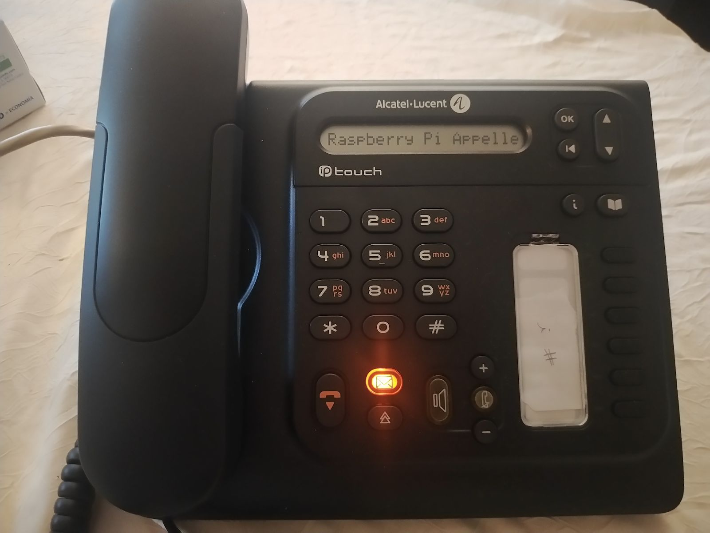
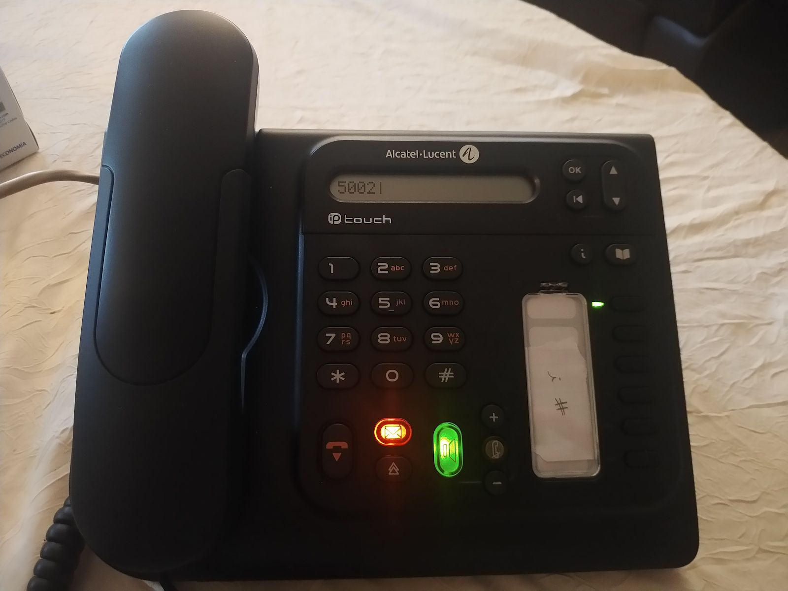

<div align="center">
<br>

<br>
<br>

# Setting up a VoIP communication between a Raspberry Pi and an IP phone using an Asterisk IP PBX server

**Guillaume Nibert  
Supervisor: [Dr. Ahmed Lounis](https://www.hds.utc.fr/~lounisah/dokuwiki/)**

</div>

## [Context](README.md)

## [1. SIP protocol and VoIP communication](1_sip_voip.md)

## [2. Implementation of an Asterisk IP PBX server](2_ipbx_asterisk.md)

## [3. Installation and configuration of a SIP client on the Raspberry Pi](3_install_client_sip_rpi)

## [4. IP phone configuration](4_config_alcatel.md)

## 5. Communication tests

<p style="text-align: justify; text-indent: 3em;">
All endpoints are connected to the Asterisk server. It is therefore possible to call from the Raspberry Pi to the Alcatel or from the Alcatel to the Raspberry Pi.
</p>
<p style="text-align: justify; text-indent: 3em;">
In order to carry out the communication, you must first have launched the Asterisk server, the TFTP server, turned on all the peripherals and connected an audio output on the Raspberry Pi (audio jack, Bluetooth or HDMI) to be able to listen to the audio stream.
</p>

### Raspberry Pi to Alcatel IP Touch

1. Launch a terminal and run ***linphonec***.

```bash
linphonec
```

2. Call the Alcatel IP Touch phone, it has the number **`5001`** (see **[part 2 - SIP configuration and user creation](#2-mise-en-oeuvre-dun-serveur-pabx-ip-asterisk)**).

```
linphonec> call 5001
```

***Output (with comments)***:

<pre>
<b><span style="color:green;"># Error message, not important, video is disabled, we are only doing VoIP.</span></b>
2021-02-09 13:30:36:367 ortp-error-LinphoneCore has video disabled for both capture
and display, but video policy is to start the call with video. This is a possible
mis-use of the API. In this case, video is disabled in default LinphoneCallParams

<b><span style="color:green;"># Linking to the Alcatel phone</span>
Establishing call id to sip:5001@192.168.1.80, assigned id 1
<span style="color:green;"># The Alcatel phone has been found, it is contacted, it rings on the Alcatel
# side.</span>
Contacting sip:5001@192.168.1.80
linphonec> Call 1 to sip:5001@192.168.1.80 in progress.
linphonec> Call 1 with sip:5001@192.168.1.80 connected.
<span style="color:green;"># We picked up the Alcatel phone.</span>
Call answered by sip:5001@192.168.1.80
<span style="color:green;"># Communication is in progress, audio is playing, settings are adjusted.</span>
linphonec> 2021-02-09 13:30:36:563 ortp-error-no such method on filter MSPulseWrite,
fid=16394 method index=2
Media streams established with sip:5001@192.168.1.80 for call 1 (audio).
Call is updated by remote.
linphonec> 2021-02-09 13:30:40:761 ortp-error-no such method on filter MSPulseWrite,
fid=16394 method index=2
Call parameters were successfully modified.
linphonec> Media streams established with sip:5001@192.168.1.80 for call 1 (audio).
Call is updated by remote.
linphonec> Call parameters were successfully modified.
linphonec> Media streams established with sip:5001@192.168.1.80 for call 1 (audio).
<span style="color:green;"># The call has just ended, someone has hung up one of the devices.</span>
Call terminated.
linphonec> Call 1 with sip:5001@192.168.1.80 ended (No error).</b>
</pre>
<p style="text-align: justify;">
When the call is initiated, the Alcatel phone screen displays the following:
</p>

<div align="center">


*(Figure 15 - Call from Raspberry Pi to Alcatel IP Touch 4018 EE)*

</div>

<p style="text-align: justify;">
The communication therefore works in one direction. Let's see what happens if the Alcatel calls the Raspberry Pi.
</p>

### Alcatel IP Touch to Raspberry Pi

1. From the phone, call the Raspberry Pi's number **`5002`** (see **[part 2 - SIP configuration and user creation](#2-mise-en-oeuvre-dun-serveur-pabx-ip-asterisk)**).

<div align="center">


*(Figure 16 - Call from Alcatel IP Touch 4018 EE to Raspberry Pi)*

</div>

2. From the Raspberry Pi terminal, make sure that ***linphonec*** is active. When the Alcatel launches its call, it is received in the terminal:

***Output***:

```
linphonec> Receiving new incoming call from "Alcaltel IP Touch" <sip:5001@192.168.1.80>, assigned id 3
```
<p style="text-align: justify;">
    To answer it, just type <b><i><code>answer</code></i></b> and the call <b><i>ID</i></b>:
</p>

```
answer 3
```
<p style="text-align: justify; text-indent: 3em;">
The communication is launched and works in the same way.
</p>

***Output***:

<pre>
linphonec> Receiving new incoming call from "Alcaltel IP Touch" <sip:5001@192.168.1.80>, assigned id 3
<b>answer 3</b>
Connected.
<b>linphonec> Call 3 with "Alcaltel IP Touch" <sip:5001@192.168.1.80> connected.
2021-02-09 13:46:28:345 ortp-error-no such method on filter MSPulseWrite, fid=16394
method index=2</b>
Media streams established with "Alcaltel IP Touch" <sip:5001@192.168.1.80> for call 3 (audio).
<b>linphonec> Call is updated by remote.</b>
<b>linphonec> 2021-02-09 13:46:28:424 ortp-error-no such method on filter MSPulseWrite,
fid=16394
method index=2</b>
Call parameters were successfully modified.
linphonec> Media streams established with "Alcaltel IP Touch" <sip:5001@192.168.1.80> for call 3 (audio).</b>
Call is updated by remote.
<b>linphonec> Call parameters were successfully modified.</b>
<b>linphonec> Media streams established with "Alcaltel IP Touch" <sip:5001@192.168.1.80> for call 3 (audio).</b>
Call terminated.
<b>linphonec> Call 3 with "Alcaltel IP Touch" <sip:5001@192.168.1.80> ended (No error).</b>
</pre>

<p style="text-align: justify; text-indent: 3em;">
The communications therefore work in both directions. The objective of the next part is to create a graphical interface in JavaScript on the Raspberry Pi side, more user-friendly than the <b><i>linphonec</i></b> command line client.
</p>

## [6. JavaScript SIP client using WebRTC](6_sip_webrtc.md)

## [Conclusion](Conclusion.md)

## [Abbreviations](Abbreviations.md)