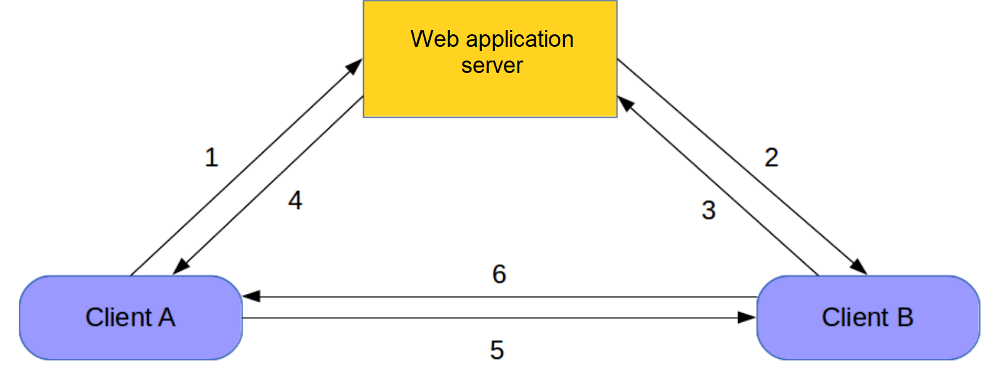
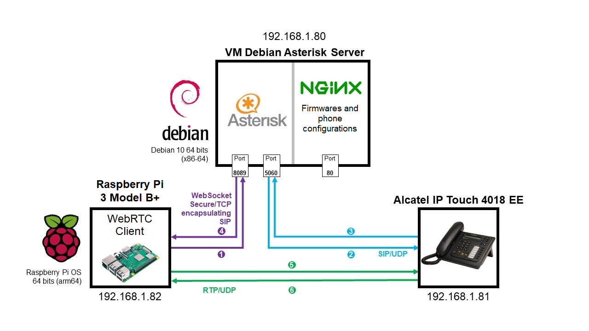

<div align="center">
<br>

<br>
<br>

# Setting up a VoIP communication between a Raspberry Pi and an IP phone using an Asterisk IP PBX server

**Guillaume Nibert  
Supervisor: [Dr. Ahmed Lounis](https://www.hds.utc.fr/~lounisah/dokuwiki/)**

</div>

## [Context](README.md)

## [1. SIP protocol and VoIP communication](1_sip_voip.md)

## [2. Implementation of an Asterisk IP PBX server](2_ipbx_asterisk.md)

## [3. Installation and configuration of a SIP client on the Raspberry Pi](3_install_client_sip_rpi)

## [4. IP phone configuration](4_config_alcatel.md)

## [5. Communication tests](5_tests_com_sip.md)

## 6. JavaScript SIP client using WebRTC

<p style="text-align: justify; text-indent: 3em;">
The establishment of the communication (SIP) as well as the communication itself (RTP) works correctly. The development of a SIP client program in JavaScript will require modifications to our environment. Indeed, we are going to make a call from a web browser supporting JavaScript to another device (having a JavaScript SIP client or not). Before starting the implementation. It is necessary to understand what the WebRTC, WebSocket APIs are.
</p>

### WebRTC & WebSocket

<p style="text-align: justify; text-indent: 3em;">
    The WebRTC (<i>Web Real-Time Communication</i>) API is a software interface whose purpose is to link two devices so that they can communicate directly. This connection requires opening a communication channel between a client and a server: the technology that allows this is the WebSocket API. 
</p>
<p style="text-align: justify; text-indent: 3em;">
In concrete terms, establishing a connection works in a similar way to SIP. Below is an explanatory diagram from Wikipedia.
</p>

<div align="center">


<p style="text-align: center;">
    <i>(Figure 17 - Establishing a connection between two clients)</i><br>
<span style="font-size: 15px;">Attribution: <a href="https://commons.wikimedia.org/wiki/File:Etablissement_d%27une_connexion_par_WebRTC.svg" hreflang="en" target="_blank">adapted from the original work of Feyd-Aran</a>, <a href="https://creativecommons.org/licenses/by-sa/3.0/deed.fr" hreflang="fr" target="_blank">CC BY-SA 3.0</a>, via Wikimedia Commons</span>
</p>

</div>

>  - 1: A asks the server for a connection with B.
>  - 2: The server relays the request from A to B.
>  - 3: If B accepts, it sends a connection request to A.
>  - 4: The server relays the request to A.
>  - 5 and 6: Bidirectional PeerConnection is established.
<p style="text-align: right;">
    — <a href="https://fr.wikipedia.org/wiki/WebRTC#Description_g%C3%A9n%C3%A9rale_de_la_norme" hreflang="fr" target="_blank"><i>Wikipédia</i></a>
</p>

 <p style="text-align: justify; text-indent: 3em;">
The PeerConnection corresponds in our case to the RTP flow between the two clients. Once the communication is established, as with SIP, the communication between the two clients is direct and the media flows do not pass through the application web server.
</p>
<p style="text-align: justify; text-indent: 3em;">
Let's imagine now:
</p>

  - Client A: Raspberry Pi, with Mozilla Firefox web browser supporting WebRTC.
 - Client B: Alcatel IP Touch 4018 EE, not supporting WebRTC.

<p style="text-align: justify; text-indent: 3em;">
    <b><i>How can the two endpoints be made to communicate?</i></b>
</p>
<p style="text-align: justify; text-indent: 3em;">
The Alcatel phone cannot support WebRTC, it is proprietary hardware, the source code is closed.
</p>
<p style="text-align: justify; text-indent: 3em;">
    On the Raspberry Pi side, however, it is possible to use WebRTC and SIP by encapsulating the SIP protocol in a WebSocket. This is defined in <a href="https://tools.ietf.org/html/rfc7118" hreflang="en" target="_blank">RFC 7118</a> and requires a server that can handle WebRTC/SIP for client A and only SIP for client B. The Asterisk server supports WebRTC with SIP. Therefore, modifications are required to make the server capable of supporting WebRTC. 
</p>

<div align="center">


*(Figure 18 - Raspberry Pi calls Alcatel IP Touch from a WebRTC client)*

</div>

<p style="text-align: justify; text-indent: 3em;">
    At the Raspberry Pi client level, web browsers such as Mozilla Firefox, Safari or those based on Chromium natively implement the WebRTC API. In this project, Mozilla Firefox will be used as a client using WebRTC.
</p>

### Configuring the Asterisk server to support the WebRTC API

In order to improve the security between the WebRTC client and the Asterisk server, a secure web socket (WSS) via TLS will be set up. We will therefore first generate a self-signed certificate.

#### Generating a self-signed SSL/TLS certificate

<p style="text-align: justify; text-indent: 3em;">
    In order to improve security and modernise, we adopt a certificate generated with ECDSA algorithms, which are much more efficient than the classic RSA algorithms <b>(<a style="text-decoration: none;" href="#ecdsa" name="ecdsa_text">11</a>)</b>. We will use the ECDSA P-521 algorithm, recommended by the ANSSI (French National Agency for the Security of Information Systems) <b>(<a style="text-decoration: none;" href="#ecdsa_anssi" name="ecdsa_anssi_text">12</a>)</b> and compatible with Mozilla Firefox.
</p>
<p style="text-align: justify; text-indent: 3em;">
    To perform this operation, you must first have started the Debian virtual machine and have the OpenSSL tool.
</p>

1. Se connecter en SSH à la machine `asterisktz`.

1. Connect via SSH to the `asterisktz` machine.

<pre>
<span style="color:green;"># ssh login@vm_ip_address -p 22</span>
ssh asterisktz@192.168.1.80 -p 22
</pre>

2. Create the folders in which the Certificate Authority's certificate, called the root certificate (***ca***), the certificate associated with the IP *192.168.1.80* (***certs***) and the certificate signing request file to the authority (***csr***) are stored.

```bash
mkdir ca && mkdir certs && mkdir csr
```

3. Creation of certificates.

Create the private key of the root certificate (certification authority)

```bash
openssl ecparam -genkey -name secp521r1 -out ca/TZVoIP-Root-CA.key
```

Generate the root certificate from its private key

```bash
openssl req -x509 -new -nodes -key ca/TZVoIP-Root-CA.key -sha384 -days 3650 -utf8 -out ca/TZVoIP-Root-CA.crt
```

***Information to be filled in***:

<pre>
You are about to be asked to enter information that will be incorporated
into your certificate request.
What you are about to enter is what is called a Distinguished Name or a DN.
There are quite a few fields but you can leave some blank
For some fields there will be a default value,
If you enter '.', the field will be left blank.
-----
Country Name (2 letter code) [AU]:<b>FR</b>
State or Province Name (full name) [Some-State]:<b>Hauts-de-France</b>
Locality Name (eg, city) []:<b>Compiègne</b>
Organization Name (eg, company) [Internet Widgits Pty Ltd]:<b>Université de Technologie de Compiègne</b>
Organizational Unit Name (eg, section) []:<b>TZ VoIP</b>
Common Name (e.g. server FQDN or YOUR name) []:<b>TZ VoIP Root</b>
Email Address []:<b>guillaume.nibert@etu.utc.fr</b>
</pre>

Generate the private key of the IP address certificate and its signature request file.

```bash
openssl req -new -sha384 -nodes -utf8 -out csr/asterisktz.csr -newkey ec:<(openssl ecparam -name secp521r1) -keyout certs/asterisktz.key
```

***Information to be filled in***:

<pre>
Generating an EC private key
writing new private key to 'certs/asterisktz.key'
-----
You are about to be asked to enter information that will be incorporated
into your certificate request.
What you are about to enter is what is called a Distinguished Name or a DN.
There are quite a few fields but you can leave some blank
For some fields there will be a default value,
If you enter '.', the field will be left blank.
-----
Country Name (2 letter code) [AU]:<b>FR</b>
State or Province Name (full name) [Some-State]:<b>Hauts-de-France</b>
Locality Name (eg, city) []:<b>Compiègne</b>
Organization Name (eg, company) [Internet Widgits Pty Ltd]:<b>Université de Technologie de Compiègne</b>
Organizational Unit Name (eg, section) []:<b>TZ VoIP</b>
Common Name (e.g. server FQDN or YOUR name) []:<b>192.168.1.80</b>
Email Address []:<b>guillaume.nibert@etu.utc.fr</b>

Please enter the following 'extra' attributes
to be sent with your certificate request
A challenge password []:
An optional company name []:
</pre>

Create the file containing the parameters of the certificate to be created.

```bash
nano csr/openssl-v3.cnf
```

***csr/openssl-v3.cnf***

```
authorityKeyIdentifier=keyid,issuer
basicConstraints=CA:FALSE
keyUsage = digitalSignature, nonRepudiation, keyEncipherment, dataEncipherment
subjectAltName = @alt_names

[alt_names]
IP.1 = 192.168.1.80
```

Generate the certificate and signature with the certification authority.

```bash
openssl x509 -req -in csr/asterisktz.csr -CA ca/TZVoIP-Root-CA.crt -CAkey ca/TZVoIP-Root-CA.key -CAcreateserial -out certs/asterisktz.crt -days 365 -sha384 -extfile csr/openssl-v3.cnf
```

Produce the full-chain certificate.

```bash
cat certs/asterisktz.crt certs/asterisktz.key > certs/asterisktz.pem
```

Change the permissions.

```bash
chmod a+r certs/asterisktz.pem
```

<p style="text-align: justify; text-indent: 3em;">
    The self-signed certificate has been created. For more details about the certification process for a non-self-signed certificate, see:  <a href="https://letsencrypt.org/how-it-works/" hreflang="en" target="_blank">https://letsencrypt.org/how-it-works/</a>. Let's move on to enabling the HTTP server built into Asterisk.
</p>

#### Enabling the Asterisk HTTP server

On the same machine:

1. Edit the configuration file for Asterisk's built-in HTTP server.

```bash
sudo nano /etc/asterisk/http.conf
```

2. Replace the contents with:

***/etc/asterisk/http.conf***

```
[general]
enabled=no
tlsenable=yes
tlsbindaddr=0.0.0.0:8089
tlscertfile=/home/asterisktz/certs/asterisktz.crt
tlsprivatekey=/home/asterisktz/certs/asterisktz.key
enablestatic=no
sessionlimit=1000
```
<p style="text-align: justify; text-indent: 3em;">
    Here only encrypted connections (<b><i>tlsenable=yes</i></b>) are allowed on port 8089. Unencrypted connections would be <b><i>enabled</i></b> to <b><i>yes</i></b> on port 8088.
</p>
<p style="text-align: justify; text-indent: 3em;">
Restart the Asterisk service to enable the built-in HTTP server.
</p>

```bash
sudo systemctl restart asterisk
```
<p style="text-align: justify;">
To check that the HTTP server is enabled, simply type the command <b><i><code>sudo asterisk -rvvv</code></i></b>, then the command <b><i><code>http show status</code></i></b>. It should return this:
</p>

<pre>
asterisktz*CLI> http show status
HTTP Server Status:
Prefix:
Server: Asterisk/18.2.0
Server Disabled

Enabled URI's:
/httpstatus => Asterisk HTTP General Status
/phoneprov/... => Asterisk HTTP Phone Provisioning Tool
/metrics/... => Prometheus Metrics URI
/ari/... => Asterisk RESTful API
<b><span style="color:green;">/ws => Asterisk HTTP WebSocket</span></b>

asterisktz*CLI>
</pre>
<p style="text-align: justify;">
    The element we are interested in: the use of WebSocket for SIP (<code>/ws</code>)
    Let's move on to the configuration of <b><i><code>pjsip.conf</code></i></b> and <b><i><code>extensions.conf</code></i></b> to take into account both WebRTC and SIP. We have based ourselves on the <i>Browser Phone</i> project and have adapted the configuration files in question. The files are available in the <code>asterisk_webrtc</code> directory of the Git repository.
</p>

#### Editing pjsip.conf to support WebRTC

1. Edit the `pjsip.conf` configuration file. 

```bash
sudo nano /etc/asterisk/pjsip.conf
```

2. Replace content with:

*`/etc/asterisk/pjsip.conf`*

<pre>
conf
[global]
<span style="color:dodgerblue;">max_forwards</span>=70
<span style="color:dodgerblue;">user_agent</span>=AsteriskTZ
<span style="color:dodgerblue;">default_realm</span>=192.168.1.80
<span style="color:dodgerblue;">keep_alive_interval</span>=300

<span style="color:green;">; == Transport</span>

[udp_transport]
<span style="color:dodgerblue;">type</span>=transport
<span style="color:dodgerblue;">protocol</span>=udp
<span style="color:dodgerblue;">bind</span>=0.0.0.0
<span style="color:dodgerblue;">tos</span>=af42
<span style="color:dodgerblue;">cos</span>=3

[wss_transport]
<span style="color:dodgerblue;">type</span>=transport
<span style="color:dodgerblue;">protocol</span>=wss
<span style="color:dodgerblue;">bind</span>=0.0.0.0

[tcp_transport]
<span style="color:dodgerblue;">type</span>=transport
<span style="color:dodgerblue;">protocol</span>=tcp
<span style="color:dodgerblue;">bind</span>=0.0.0.0

[tls_transport]
<span style="color:dodgerblue;">type</span>=transport
<span style="color:dodgerblue;">protocol</span>=tls
<span style="color:dodgerblue;">bind</span>=0.0.0.0
<span style="color:dodgerblue;">cert_file</span>=/home/asterisk/certs/asterisktz.crt
<span style="color:dodgerblue;">priv_key_file</span>=/home/asterisk/certs/asterisktz.key
<span style="color:dodgerblue;">cipher</span>=ECDHE-ECDSA-AES128-GCM-SHA256:ECDHE-RSA-AES128-GCM-SHA256:ECDHE-ECDSA-AES256-GCM-SHA384:ECDHE-RSA-AES256-GCM-SHA384:ECDHE-ECDSA-CHACHA20-POLY1305:ECDHE-RSA-CHACHA20-POLY1305:DHE-RSA-AES128-GCM-SHA256:DHE-RSA-AES256-GCM-SHA384;
<span style="color:dodgerblue;">method</span>=tlsv1_2

<span style="color:green;">; == ACL</span>

[acl]    <span style="color:green;">; Communications are only allowed in Class A, B and C local</span>
<span style="color:dodgerblue;">type</span>=acl <span style="color:green;">; networks.</span>
<span style="color:dodgerblue;">deny</span>=0.0.0.0/0.0.0.0
<span style="color:dodgerblue;">permit</span>=10.0.0.0/255.0.0.0
<span style="color:dodgerblue;">permit</span>=172.16.0.0/255.240.0.0
<span style="color:dodgerblue;">permit</span>=192.168.0.0/255.255.0.0

<span style="color:green;">; Templates</span>

[single_aor](!)
<span style="color:dodgerblue;">max_contacts</span>=1
<span style="color:dodgerblue;">qualify_frequency</span>=120
<span style="color:dodgerblue;">remove_existing</span>=yes

[userpass_auth](!)
<span style="color:dodgerblue;">auth_type</span>=userpass

[basic_endpoint](!)
<span style="color:dodgerblue;">moh_suggest</span>=default
<span style="color:dodgerblue;">context</span>=from-extensions
<span style="color:dodgerblue;">inband_progress</span>=no
<span style="color:dodgerblue;">rtp_timeout</span>=120
<span style="color:dodgerblue;">message_context</span>=textmessages
<span style="color:dodgerblue;">allow_subscribe</span>=yes
<span style="color:dodgerblue;">subscribe_context</span>=subscriptions
<span style="color:dodgerblue;">direct_media</span>=yes
<span style="color:dodgerblue;">dtmf_mode</span>=rfc4733
<span style="color:dodgerblue;">device_state_busy_at</span>=1
<span style="color:dodgerblue;">disallow</span>=all

[phone_endpoint](!)
<span style="color:dodgerblue;">allow</span>=ulaw,alaw

[webrtc_endpoint](!)
<span style="color:dodgerblue;">transport</span>=wss_transport
<span style="color:dodgerblue;">allow</span>=ulaw,alaw
<span style="color:dodgerblue;">dtls_auto_generate_cert</span>=yes
<span style="color:dodgerblue;">webrtc</span>=yes

<span style="color:green;">; Users</span>

[alcatel](basic_endpoint,phone_endpoint)
<span style="color:dodgerblue;">type</span>=endpoint
<span style="color:dodgerblue;">callerid</span>=<span style="color:chocolate;">"Alcatel IP Touch"</span> <5001>
<span style="color:dodgerblue;">auth</span>=alcatel
<span style="color:dodgerblue;">aors</span>=alcatel
[alcatel](single_aor)
<span style="color:dodgerblue;">type</span>=aor
[alcatel](userpass_auth)
<span style="color:dodgerblue;">type</span>=auth
<span style="color:dodgerblue;">username</span>=alcatel
<span style="color:dodgerblue;">password</span>=11111111

[rpi](basic_endpoint,webrtc_endpoint)
<span style="color:dodgerblue;">type</span>=endpoint
<span style="color:dodgerblue;">callerid</span>=<span style="color:chocolate;">"Raspberry Pi"</span> <5002>
<span style="color:dodgerblue;">auth</span>=rpi
<span style="color:dodgerblue;">aors</span>=rpi
[rpi](single_aor)
<span style="color:dodgerblue;">type</span>=aor
[rpi](userpass_auth)
<span style="color:dodgerblue;">type</span>=auth
<span style="color:dodgerblue;">username</span>=rpi
<span style="color:dodgerblue;">password</span>=22222222

[guillaume](basic_endpoint,webrtc_endpoint)
<span style="color:dodgerblue;">type</span>=endpoint
<span style="color:dodgerblue;">callerid</span>=<span style="color:chocolate;">"Guillaume Nibert"</span> <5003>
<span style="color:dodgerblue;">auth</span>=guillaume
<span style="color:dodgerblue;">aors</span>=guillaume
[guillaume](single_aor)
<span style="color:dodgerblue;">type</span>=aor
<span style="color:dodgerblue;">mailboxes</span>=guillaume@default
[guillaume](userpass_auth)
<span style="color:dodgerblue;">type</span>=auth
<span style="color:dodgerblue;">username</span>=guillaume
<span style="color:dodgerblue;">password</span>=33333333
</pre>

<p style="text-align: justify; text-indent: 3em;">
For more details, please refer to the PJSIP documentation:<br><a href="https://wiki.asterisk.org/wiki/display/AST/PJSIP+Configuration+Sections+and+Relationships" hreflang="en" target="_blank">https://wiki.asterisk.org/wiki/display/AST/PJSIP+Configuration+Sections+and+Relationships</a>.
</p>

#### Editing `extensions.conf` to support WebRTC

3. Edit the configuration file `extensions.conf`.

```bash
sudo nano /etc/asterisk/extensions.conf
```

4. Replace the contents with:

*`/etc/asterisk/extensions.conf`*

<pre>
conf
[general]
<span style="color:dodgerblue;">static</span>=yes
<span style="color:dodgerblue;">writeprotect</span>=yes
<span style="color:dodgerblue;">priorityjumping</span>=no
<span style="color:dodgerblue;">autofallthrough</span>=no

[globals]
<span style="color:dodgerblue;">ATTENDED_TRANSFER_COMPLETE_SOUND</span>=beep

[textmessages] <span style="color:green;">; Allows you to send text for WebRTC clients</span>
<span style="color:dodgerblue;">exten</span> => 5002,1,Gosub(send-text,s,1(rpi))
<span style="color:dodgerblue;">exten</span> => 5003,1,Gosub(send-text,s,1(guillaume))

[subscriptions] <span style="color:green;">; Allows to know the status of an endpoint (in call or</span>
<span style="color:dodgerblue;">exten</span> => 5001,hint,PJSIP/alcatel <span style="color:green;">; available)</span>
<span style="color:dodgerblue;">exten</span> => 5002,hint,PJSIP/rpi
<span style="color:dodgerblue;">exten</span> => 5003,hint,PJSIP/guillaume

[from-extensions]
<span style="color:green;">; When you call 5000, you get music.</span>
<span style="color:dodgerblue;">exten</span> => 5000,1,Gosub(moh,s,1)
<span style="color:green;">; Extensions</span>
<span style="color:dodgerblue;">exten</span> => 5001,1,Gosub(dial-extension,s,1,(alcatel))
<span style="color:dodgerblue;">exten</span> => 5002,1,Gosub(dial-extension,s,1,(rpi))
<span style="color:dodgerblue;">exten</span> => 5003,1,Gosub(dial-extension,s,1,(guillaume))
<span style="color:green;">; If you have anything other than 5000, 5001, 5002 or 5003 then it is a</span>
<span style="color:green;">; wrong number, so hang up.</span>
<span style="color:dodgerblue;">exten</span> => _[+*0-9].,1,NoOp(You called: ${EXTEN})
<span style="color:dodgerblue;">exten</span> => _[+*0-9].,n,Hangup(1)

<span style="color:dodgerblue;">exten</span> => e,1,Hangup()

[moh] ; <span style="color:green;">"function" for music (see 5000). Note: "function" is an abusive</span>
<span style="color:green;">; term, it is actually called "context".</span>
<span style="color:dodgerblue;">exten</span> => s,1,NoOp(Music On Hold)
<span style="color:dodgerblue;">exten</span> => s,n,Ringing()
<span style="color:dodgerblue;">exten</span> => s,n,Wait(2)
<span style="color:dodgerblue;">exten</span> => s,n,Answer()
<span style="color:dodgerblue;">exten</span> => s,n,Wait(1)
<span style="color:dodgerblue;">exten</span> => s,n,MusicOnHold()

[dial-extension] <span style="color:green;">; "function" to call an endpoint.</span>
<span style="color:dodgerblue;">exten</span> => s,1,NoOp(Calling: ${ARG1})
<span style="color:dodgerblue;">exten</span> => s,n,Set(JITTERBUFFER(adaptive)=default)
<span style="color:dodgerblue;">exten</span> => s,n,Dial(PJSIP/${ARG1},30)
<span style="color:dodgerblue;">exten</span> => s,n,Hangup()

<span style="color:dodgerblue;">exten</span> => e,1,Hangup()

[send-text] <span style="color:green;">; "function" to send text.</span>
<span style="color:dodgerblue;">exten</span> => s,1,NoOp(Sending Text To: ${ARG1} From: ${MESSAGE(from)})
<span style="color:dodgerblue;">exten</span> => s,n,Set(<span style="color:dodgerblue;">PEER</span>=${CUT(CUT(CUT(MESSAGE(from),@,1),<,2),:,)})
<span style="color:dodgerblue;">exten</span> => s,n,Set(<span style="color:dodgerblue;">FROM</span>=${SHELL(asterisk -rx <span style="color:chocolate;">'pjsip show endpoint ${PEER}'</span> | grep <span style="color:chocolate;">'callerid '</span> | cut -d<span style="color:chocolate;">':'</span> -f2- | sed <span style="color:chocolate;">'s/^\ *//'</span> | tr -d <span style="color:chocolate;">'\n'</span>)})
<span style="color:dodgerblue;">exten</span> => s,n,Set(<span style="color:dodgerblue;">CALLERID_NUM</span>=${CUT(CUT(FROM,<,1),<2)})
<span style="color:dodgerblue;">exten</span> => s,n,Set(<span style="color:dodgerblue;">FROM_SIP</span>=${STRREPLACE(MESSAGE(from),&lt;sip:${PEER}@,&lt;sip:${CALLERID_NUM}@)})
<span style="color:dodgerblue;">exten</span> => s,n,MessageSend(pjsip:${ARG1},${FROM_SIP})
<span style="color:dodgerblue;">exten</span> => s,n,Hangup()
</pre>

<p style="text-align: justify; text-indent: 3em;">
For more details, please refer to the documentation on the configuration of the dial plan:<br>
<a href="https://wiki.asterisk.org/wiki/display/AST/Contexts%2C+Extensions%2C+and+Priorities" hreflang="en" target="_blank">https://wiki.asterisk.org/wiki/display/AST/Contexts%2C+Extensions%2C+and+Priorities</a>.
</p>

5. Restart the `asterisk` service.

```bash
sudo systemctl restart asterisk
```

### Communication tests with the Web *Browser Phone* client

<p style="text-align: justify;">
    After restarting the asterisk service. We will go to the Raspberry Pi and install Mozilla Firefox via the command <code>sudo apt install firefox-esr</code>.
</p>
<p style="text-align: justify;">
	Let's open Mozilla Firefox and enter the following URL in the address bar: <a href="https://www.innovateasterisk.com/phone/" hreflang="en" target="_blank">https://www.innovateasterisk.com/phone/</a>.
</p>
<p style="text-align: justify;">
    You must configure the fields as follows and then click on <b><i>Save</i></b>:
</p>

<div align="center">


*(Figure 19 - Configuring the WebRTC Browser Phone client)*

</div>

<p style="text-align: justify;">
    The <i>Registered</i> indication indicates that the client is indeed connected to the Asterisk server.
</p>

<div align="center">


*(Figure 20 - Registering the `rpi` client on the Asterisk server)*

</div>

<p style="text-align: justify;">
	So we can call the Alcatel IP Touch.
</p>

<div align="center">


*(Figure 21 - Raspberry Pi to Alcatel IP Touch 4018 EE call)*


*(Figure 22 - Receiving the call from the Raspberry Pi)*

</div>

<p style="text-align: justify;">
	Or from the Alcatel, call the Raspberry Pi.
</p>

<div align="center">


*(Figure 23 - Alcatel IP Touch 4018 EE to Raspberry Pi call)*


*(Figure 24 - Receiving the call from the Alcatel IP Touch)*

</div>


### Development of a JavaScript SIP client

<p style="text-align: justify; text-indent: 3em;">
Given the project and time constraints, we only had time to test existing solutions (<i>Browser Phone</i>). However, the development of a SIP client can be done via already existing libraries such as: <a href="https://sipjs.com/" hreflang="en" target="_blank">SIP.js</a>, <a href="https://jssip.net/" hreflang="en" target="_blank">JsSip</a>, <a href="https://www.doubango.org/sipml5/" hreflang="en" target="_blank">sipML5</a>...  
    For your information <i>Browser Phone</i> uses SIP.js.
</p>

## [Conclusion](Conclusion.md)

## [Abbreviations](Abbreviations.md)

## References on this page

<p><a name="ecdsa"></a><strong>(<a style="text-decoration: none;" href="#ecdsa_text">11</a>)</strong>: SECTIGO Store, <em>ECDSA vs RSA: Everything You Need to Know</em>, 9<sup>th</sup> june 2020, available at: <a href="https://sectigostore.com/blog/ecdsa-vs-rsa-everything-you-need-to-know/" hreflang="en" target="_blank">https://sectigostore.com/blog/ecdsa-vs-rsa-everything-you-need-to-know/</a>.</p>
<p><a name="ecdsa_anssi"></a><strong>(<a style="text-decoration: none;" href="#ecdsa_anssi_text">12</a>)</strong>: Agence nationale de la sécurité des systèmes d'information, <em>Logarithme discret dans les courbes elliptiques définies sur GF(p)</em> <strong>In</strong>: <em>Référentiel Général de Sécurité version 2.0 - Annexe B1</em>, p.19-20, 21<sup>st</sup> february 2014, available at: <a href="https://www.ssi.gouv.fr/uploads/2014/11/RGS_v-2-0_B1.pdf" hreflang="fr" target="_blank">https://www.ssi.gouv.fr/uploads/2014/11/RGS_v-2-0_B1.pdf</a>.</p>