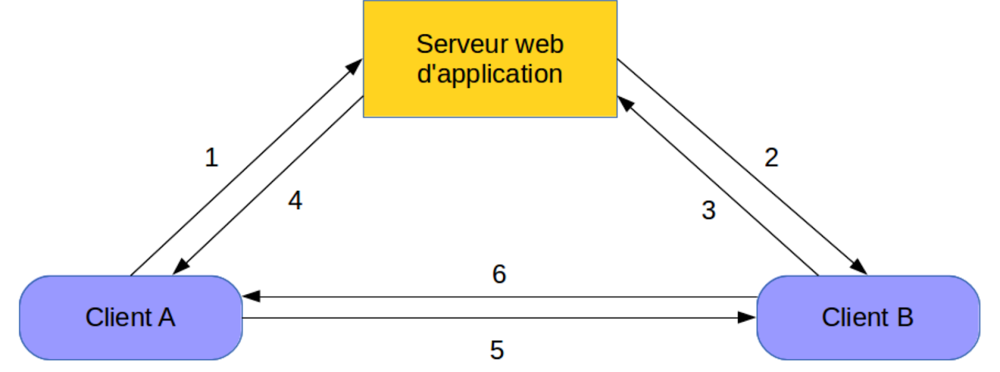
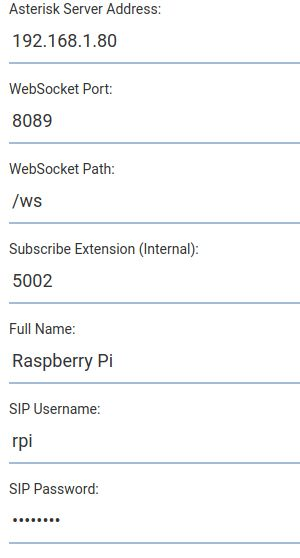
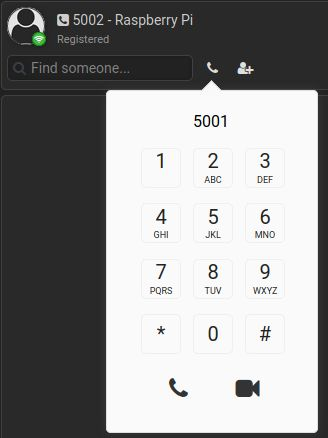
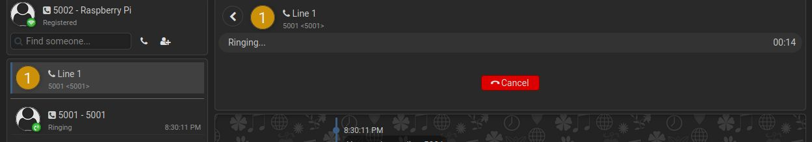
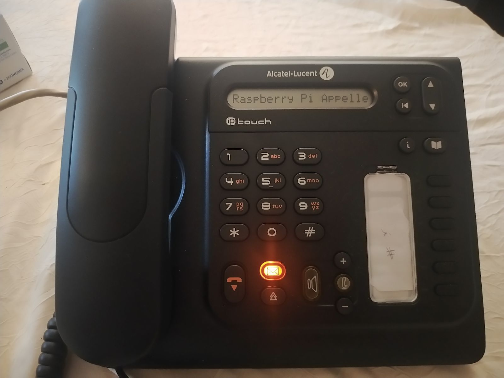
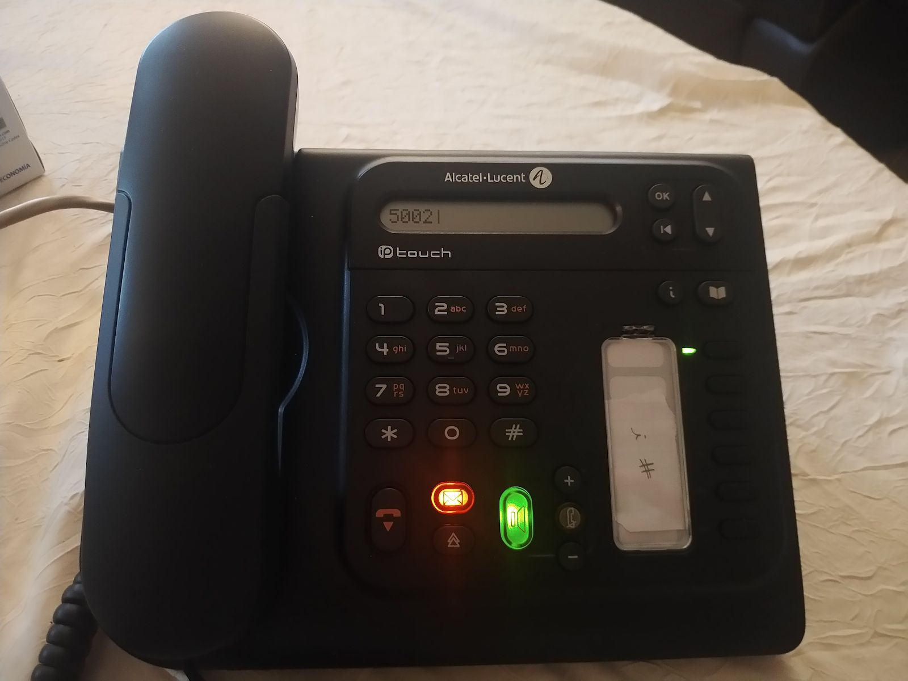
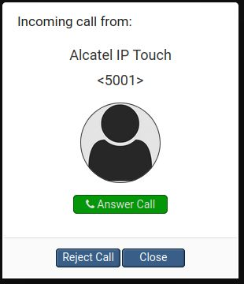

<div align="center">
<br>

<br>
<br>

# AI14 - TZ - Mise en place d'une communication VoIP entre un Raspberry Pi et un téléphone IP


**Guillaume Nibert  
Encadrant : Dr. Ahmed Lounis**

</div>

## [Contexte](README.md)

## [1. Protocole SIP et communication VoIP](1_sip_voip.md)

## [2. Mise en place d'un serveur PABX IP Asterisk](2_ipbx_asterisk.md)

## [3. Installation et configuration d'un client SIP sur le Raspberry Pi](3_install_client_sip_rpi)

## [4. Configuration du téléphone IP](4_config_alcatel.md)

## [5. Tests de communication](5_tests_com_sip.md)

## 6. Client SIP JavaScript utilisant WebRTC

L’établissement de la communication (SIP) ainsi que la communication en elle-même (RTP) fonctionnent correctement. Le développement d’un programme client SIP en JavaScript va nécessiter des modifications de notre environnement. En effet, nous allons donc passer un appel depuis un navigateur web supportant JavaScript vers un autre appareil (ayant un client SIP JavaScript ou non). Avant de commencer la mise en place. Il est nécessaire de comprendre ce que sont les API WebRTC, WebSocket.

### WebRTC & WebSocket

L’API WebRTC (*Web Real-Time Communication*) est une interface logicielle dont le but est de mettre en relation deux périphériques afin qu’ils puissent communiquer directement. Cette mise en relation nécessite d’ouvrir un canal de communication entre un client et un serveur : la technologie qui permet de répondre à cela est l’API WebSocket.

Concrètement, l’établissement d’une connexion fonctionne similairement à SIP. Ci-dessous, voici un schéma explicatif issu de Wikipédia.

<div align="center">


*(Figure 17 - Établissement d'une connexion entre deux clients utilisant WebRTC)*

</div>

“
 - 1 : A demande au serveur une connexion avec B.
 - 2 : Le serveur relaie la demande de A à B.
 - 3 : Si B accepte, il envoie une demande de connexion à A.
 - 4 : Le serveur relaie la demande à A.
 - 5 et 6 : Les PeerConnection bidirectionnelles sont établies.
 
 ” - [Wikipédia](https://fr.wikipedia.org/wiki/WebRTC#Description_g%C3%A9n%C3%A9rale_de_la_norme).

 Les PeerConnection correspondent dans notre cas au flux RTP entre les deux clients. Une fois la communication établie, comme pour SIP la communication entre les deux clients est directe et les flux médias ne passent pas par le serveur web d’application.

Imaginons maintenant :
 - client A : Raspberry Pi, disposant du navigateur web Mozilla Firefox prenant en charge WebRTC.
 - client B : Alcatel IP Touch 4018 EE, ne prenant pas en charge WebRTC.

***Comment faire communiquer les deux points de terminaison ?***

On ne peut pas faire en sorte que le téléphone Alcatel puisse prendre en charge WebRTC, c’est du matériel propriétaire, le code source est fermé, et même si cela était possible, cela prendrait nécessiterait une durée de travail non négligeable afin de comprendre comment le logiciel fonctionne, programmer de nouveaux firmwares et configurer le système.

En revanche, côté Raspberry Pi, il est possible d’utiliser WebRTC et SIP en encapsulant le protocole SIP dans une WebSocket. Cela est défini dans la [RFC 7118](https://tools.ietf.org/html/rfc7118). Il faut également un serveur capable de gérer WebRTC/SIP pour le client A et seulement SIP pour le client B. Le serveur Asterisk prend en charge WebRTC avec SIP. Il faut donc apporter des modifications pour que le serveur puisse prendre en charge WebRTC.

<div align="center">


*(Figure 18 - Raspberry Pi appelle Alcatel IP Touch depuis un client WebRTC)*

</div>

Au niveau du client Raspberry Pi, les navigateurs web tels que Mozilla Firefox, Safari ou encore ceux basés sur Chromium implémentent nativement l’API WebRTC. Nous utiliserons Mozilla Firefox comme client utilisant WebRTC.

### Configuration du serveur Asterisk pour prendre en charge l’API WebRTC

Afin d’améliorer la sécurité entre le client WebRTC et le serveur Asterisk, nous allons mettre en place une web socket sécurisée (WSS) via TLS. Nous allons donc dans un premier temps générer un certificat auto signé.

#### Génération d’un certificat SSL/TLS auto signé

Dans un but d’amélioration de la sécurité et de modernisation, nous adoptons un certificat généré avec des algorithmes ECDSA, bien plus performants que les algorithmes RSA classiques **([11](#ecdsa))**. Nous allons utiliser l’algorithme ECDSA P-521, recommandé par l’ANSSI **([12](#ecdsa_anssi))** et compatible avec Mozilla Firefox.
Pour réaliser cette opération, il faut avoir au préalable démarré la machine virtuelle Debian et l’outil OpenSSL.

1. Se connecter en SSH à la machine `asterisktz`.

```bash
# ssh login@adresse_ip_vm -p 22
ssh asterisktz@192.168.1.80 -p 22
```

2. Créer les dossiers dans lesquels seront stockés le certificat de l’Autorité de Certification, appelé certificat racine (***ca***), le certificat associé à l’IP *192.168.1.80* (***certs***) et le fichier de demande de signature de certificat à l’autorité (***csr***).

```bash
mkdir ca && mkdir certs && mkdir csr
```

3. Création des certificats.

Création de la clef privée du certificat racine (autorité de certification)

```bash
openssl ecparam -genkey -name secp521r1 -out ca/TZVoIP-Root-CA.key
```

Génération du certificat racine à partir de sa clef privée.

```bash
openssl req -x509 -new -nodes -key ca/TZVoIP-Root-CA.key -sha384 -days 3650 -utf8 -out ca/TZVoIP-Root-CA.crt
```

*Informations à renseigner*

```
You are about to be asked to enter information that will be incorporated
into your certificate request.
What you are about to enter is what is called a Distinguished Name or a DN.
There are quite a few fields but you can leave some blank
For some fields there will be a default value,
If you enter '.', the field will be left blank.
-----
Country Name (2 letter code) [AU]:FR
State or Province Name (full name) [Some-State]:Hauts-de-France
Locality Name (eg, city) []:Compiègne
Organization Name (eg, company) [Internet Widgits Pty Ltd]:Université de Technologie de Compiègne
Organizational Unit Name (eg, section) []:TZ VoIP
Common Name (e.g. server FQDN or YOUR name) []:TZ VoIP Root
Email Address []:guillaume.nibert@etu.utc.fr
```

Génération de la clé privée du certificat de l’IP et de son fichier de demande de signature.

```bash
openssl req -new -sha384 -nodes -utf8 -out csr/asterisktz.csr -newkey ec:<(openssl ecparam -name secp521r1) -keyout certs/asterisktz.key
```

*Informations à renseigner*

```
Generating an EC private key
writing new private key to 'certs/asterisktz.key'
-----
You are about to be asked to enter information that will be incorporated
into your certificate request.
What you are about to enter is what is called a Distinguished Name or a DN.
There are quite a few fields but you can leave some blank
For some fields there will be a default value,
If you enter '.', the field will be left blank.
-----
Country Name (2 letter code) [AU]:FR
State or Province Name (full name) [Some-State]:Hauts-de-France
Locality Name (eg, city) []:Compiègne
Organization Name (eg, company) [Internet Widgits Pty Ltd]:Université de Technologie de Compiègne
Organizational Unit Name (eg, section) []:TZ VoIP
Common Name (e.g. server FQDN or YOUR name) []:192.168.1.80
Email Address []:guillaume.nibert@etu.utc.fr

Please enter the following 'extra' attributes
to be sent with your certificate request
A challenge password []:
An optional company name []:
```

Création du fichier contenant les paramètres du certificat à créer.

```bash
nano csr/openssl-v3.cnf
```

*`csr/openssl-v3.cnf`*

```
authorityKeyIdentifier=keyid,issuer
basicConstraints=CA:FALSE
keyUsage = digitalSignature, nonRepudiation, keyEncipherment, dataEncipherment
subjectAltName = @alt_names

[alt_names]
IP.1 = 192.168.1.80
```

Génération du certificat et signature auprès de l’autorité de certification.

```bash
openssl x509 -req -in csr/asterisktz.csr -CA ca/TZVoIP-Root-CA.crt -CAkey ca/TZVoIP-Root-CA.key -CAcreateserial -out certs/asterisktz.crt -days 365 -sha384 -extfile csr/openssl-v3.cnf
```

Fabrication du certificat full-chain.

```bash
cat certs/asterisktz.crt certs/asterisktz.key > certs/asterisktz.pem
```

Modification des droits.

```bash
chmod a+r certs/asterisktz.pem
```

Le certificat auto signé a été créé. Pour plus de détails concernant le processus de certification dans le cas d’un certificat non autosigné, consulter : https://letsencrypt.org/fr/how-it-works/. Passons à l’activation du serveur HTTP intégré à Asterisk.

#### Activation du serveur HTTP d’Asterisk

Sur la même machine :

1. Éditer le fichier de configuration du serveur HTTP intégré à Asterisk.

```bash
sudo nano /etc/asterisk/http.conf
```

2. Remplacer le contenu par :

*`/etc/asterisk/http.conf`*

```
[general]
enabled=no
tlsenable=yes
tlsbindaddr=0.0.0.0:8089
tlscertfile=/home/asterisktz/certs/asterisktz.crt
tlsprivatekey=/home/asterisktz/certs/asterisktz.key
enablestatic=no
sessionlimit=1000
```

Ici on n’autorise que des connexions chiffrées (***tlsenable=yes***) sur le port 8089. Les connexions non chiffrées seraient activables en passant ***enabled*** à ***yes*** sur le port 8088.

Redémarrer le service Asterisk pour activer le serveur HTTP intégré.

```bash
sudo systemctl restart asterisk
```

Pour vérifier l’activation du serveur HTTP, il suffit de taper la commande ***`sudo asterisk -rvvv`***, puis la commande ***`http show status`***. Elle devrait renvoyer ceci :

```
asterisktz*CLI> http show status
HTTP Server Status:
Prefix:
Server: Asterisk/18.2.0
Server Disabled

Enabled URI's:
/httpstatus => Asterisk HTTP General Status
/phoneprov/... => Asterisk HTTP Phone Provisioning Tool
/metrics/... => Prometheus Metrics URI
/ari/... => Asterisk RESTful API
/ws => Asterisk HTTP WebSocket

asterisktz*CLI>
```

L’élément qui nous intéresse : l’utilisation du WebSocket pour SIP (`/ws`)
Passons maintenant à la configuration de ***`pjsip.conf`*** et de ***`extensions.conf`*** pour prendre en compte à la fois WebRTC et SIP. Nous nous sommes basés sur le projet *Browser Phone* et avons adapté les fichiers de configurations en question. Les fichiers sont disponibles dans le répertoire `asterisk_webrtc` du dépôt Git.

#### Modification de pjsip.conf pour prendre en charge WebRTC

1. Éditer le fichier de configuration `pjsip.conf`.

```bash
sudo nano /etc/asterisk/pjsip.conf
```

2. Remplacer le contenu par :

*`/etc/asterisk/pjsip.conf`*

```conf
[global]
max_forwards=70
user_agent=AsteriskTZ
default_realm=192.168.1.80
keep_alive_interval=300
 
; == Transports
 
[udp_transport]
type=transport
protocol=udp
bind=0.0.0.0
tos=af42
cos=3
 
[wss_transport]
type=transport
protocol=wss
bind=0.0.0.0
 
[tcp_transport]
type=transport
protocol=tcp
bind=0.0.0.0
 
[tls_transport]
type=transport
protocol=tls
bind=0.0.0.0
cert_file=/home/asterisk/certs/asterisktz.crt
priv_key_file=/home/asterisk/certs/asterisktz.key
cipher=ECDHE-ECDSA-AES128-GCM-SHA256:ECDHE-RSA-AES128-GCM-SHA256:ECDHE-ECDSA-AES256-GCM-SHA384:ECDHE-RSA-AES256-GCM-SHA384:ECDHE-ECDSA-CHACHA20-POLY1305:ECDHE-RSA-CHACHA20-POLY1305:DHE-RSA-AES128-GCM-SHA256:DHE-RSA-AES256-GCM-SHA384;
method=tlsv1_2
 
; == ACL
 
[acl]    ; Les communications sont uniquement autorisées dans réseaux locaux de classes A, 
type=acl ; B et C.
deny=0.0.0.0/0.0.0.0
permit=10.0.0.0/255.0.0.0
permit=172.16.0.0/255.240.0.0
permit=192.168.0.0/255.255.0.0
 
; Modèles
 
[single_aor](!)
max_contacts=1
qualify_frequency=120
remove_existing=yes
 
[userpass_auth](!)
auth_type=userpass
 
[basic_endpoint](!)
moh_suggest=default
context=from-extensions
inband_progress=no
rtp_timeout=120
message_context=textmessages
allow_subscribe=yes
subscribe_context=subscriptions
direct_media=yes
dtmf_mode=rfc4733
device_state_busy_at=1
disallow=all
 
[phone_endpoint](!)
allow=ulaw,alaw
 
[webrtc_endpoint](!)
transport=wss_transport
allow=ulaw,alaw
dtls_auto_generate_cert=yes
webrtc=yes
 
; Utilisateurs
 
[alcatel](basic_endpoint,phone_endpoint)
type=endpoint
callerid="Alcatel IP Touch" <5001>
auth=alcatel
aors=alcatel
[alcatel](single_aor)
type=aor
[alcatel](userpass_auth)
type=auth
username=alcatel
password=11111111
 
[rpi](basic_endpoint,webrtc_endpoint)
type=endpoint
callerid="Raspberry Pi" <5002>
auth=rpi
aors=rpi
[rpi](single_aor)
type=aor
[rpi](userpass_auth)
type=auth
username=rpi
password=22222222
 
[guillaume](basic_endpoint,webrtc_endpoint)
type=endpoint
callerid="Guillaume Nibert" <5003>
auth=guillaume
aors=guillaume
[guillaume](single_aor)
type=aor
mailboxes=guillaume@default
[guillaume](userpass_auth)
type=auth
username=guillaume
password=33333333
```

Pour davantage de détails, se référer à la documentation de PJSIP : https://wiki.asterisk.org/wiki/display/AST/PJSIP+Configuration+Sections+and+Relationships.

#### Modification de `extensions.conf` pour prendre en charge WebRTC

3. Éditer le fichier de configuration `extensions.conf`.

```bash
sudo nano /etc/asterisk/extensions.conf
```

4. Remplacer le contenu par :

*`/etc/asterisk/extensions.conf`*

```conf
[general]
static=yes
writeprotect=yes
priorityjumping=no
autofallthrough=no
 
[globals]
ATTENDED_TRANSFER_COMPLETE_SOUND=beep
 
[textmessages] ; Permet en plus d’envoyer du texte pour les clients WebRTC
exten => 5002,1,Gosub(send-text,s,1(rpi))
exten => 5003,1,Gosub(send-text,s,1(guillaume))
 
[subscriptions] ; Permet de connaître l’état d’un point de terminaison (en appel ou 
exten => 5001,hint,PJSIP/alcatel ; disponible)
exten => 5002,hint,PJSIP/rpi
exten => 5003,hint,PJSIP/guillaume
 
[from-extensions]
; Lorsqu’on appelle le 5000, on a de la musique
exten => 5000,1,Gosub(moh,s,1)
; Extensions
exten => 5001,1,Gosub(dial-extension,s,1,(alcatel))
exten => 5002,1,Gosub(dial-extension,s,1,(rpi))
exten => 5003,1,Gosub(dial-extension,s,1,(guillaume))
; Si on a autre chose que le 5000, 5001, 5002 ou 5003 alors c’est un faux numéro, donc on
; raccroche
exten => _[+*0-9].,1,NoOp(You called: ${EXTEN})
exten => _[+*0-9].,n,Hangup(1)
 
exten => e,1,Hangup()
 
[moh] ; “fonction” pour la musique (cf. 5000). Rem : “fonction” est abusif, cela s'appelle
; en réalité le contexte.
exten => s,1,NoOp(Music On Hold)
exten => s,n,Ringing()
exten => s,n,Wait(2)
exten => s,n,Answer()
exten => s,n,Wait(1)
exten => s,n,MusicOnHold()
 
[dial-extension] ; “fonction” pour appeler un point de terminaison.
exten => s,1,NoOp(Calling: ${ARG1})
exten => s,n,Set(JITTERBUFFER(adaptive)=default)
exten => s,n,Dial(PJSIP/${ARG1},30)
exten => s,n,Hangup()
 
exten => e,1,Hangup()
 
[send-text] ; “fonction” pour envoyer du texte.
exten => s,1,NoOp(Sending Text To: ${ARG1} From: ${MESSAGE(from)})
exten => s,n,Set(PEER=${CUT(CUT(CUT(MESSAGE(from),@,1),<,2),:,)})
exten => s,n,Set(FROM=${SHELL(asterisk -rx 'pjsip show endpoint ${PEER}' | grep 'callerid ' | cut -d':' -f2- | sed 's/^\ *//' | tr -d '\n')})
exten => s,n,Set(CALLERID_NUM=${CUT(CUT(FROM,<,1),<2)})
exten => s,n,Set(FROM_SIP=${STRREPLACE(MESSAGE(from),<sip:${PEER}@,<sip:${CALLERID_NUM}@)})
exten => s,n,MessageSend(pjsip:${ARG1},${FROM_SIP})
exten => s,n,Hangup()
```

Pour davantage de détails, se référer à la documentation sur la configuration du plan de numérotation : 
https://wiki.asterisk.org/wiki/display/AST/Contexts%2C+Extensions%2C+and+Priorities.

5. Redémarrer le service `asterisk`.

```bash
sudo systemctl restart asterisk
```

### Tests de communication avec le client Web *Browser Phone*

Après avoir redémarré le service asterisk. Nous allons nous rendre sur le Raspberry Pi et installer Mozilla Firefox via la commande `sudo apt install firefox-esr`.

Ouvrons donc maintenant Mozilla Firefox et entrons dans la barre d’adresse l’URL suivante : https://www.innovateasterisk.com/phone/.

Il faut configurer les champs de la manière suivante puis cliquer sur ***Save*** :

<div align="center">


*(Figure 19 - Configuration du client WebRTC Browser Phone)*

</div>

L’indication *Registered* indique que le client est bien connecté au serveur Asterisk.

<div align="center">


*(Figure 20 - Enregistrement du client `rpi` sur le serveur Asterisk)*

</div>

Nous pouvons donc appeler l’Alcatel IP Touch.

<div align="center">



*(Figure 21 - Appel Raspberry Pi vers Alcatel IP Touch 4018 EE)*



*(Figure 22 - Réception de l’appel du Raspberry Pi)*

</div>

Ou bien depuis l’Alcatel appeler le Raspberry Pi.

<div align="center">


*(Figure 23 - Appel Alcatel IP Touch 4018 EE vers Raspberry Pi)*



*(Figure 24 - Réception de l’appel de l’Alcatel IP Touch)*

</div>


### Développement d'un client SIP JavaScript

Compte tenu du projet et des temps, nous n'avons eu le temps que de tester des solutions déjà existantes (*Browser Phone*). Toutefois, le développement d’un client SIP peut se faire via les librairies déjà existantes telles que : [SIP.js](https://sipjs.com/), [JsSip](https://jssip.net/), [sipML5](https://www.doubango.org/sipml5/)...  
Pour information *Browser Phone* utilise SIP.js.

## [Conclusion](Conclusion.md)

## [Sigles](Sigles.md)

## Références de cette page

<a name="ecdsa"></a>**(11)** : SECTIGO Store, *ECDSA vs RSA: Everything You Need to Know*, 9 juin 2020, Disponible sur : https://sectigostore.com/blog/ecdsa-vs-rsa-everything-you-need-to-know/.

<a name="ecdsa_anssi"></a>**(12)** : Agence nationale de la sécurité des systèmes d'information, *Logarithme discret dans les courbes elliptiques définies sur GF(p)* **In** : *Référentiel Général de Sécurité version 2.0 - Annexe B1*, p.19-20, 21 février 2014, Disponible sur : https://www.ssi.gouv.fr/uploads/2014/11/RGS_v-2-0_B1.pdf.