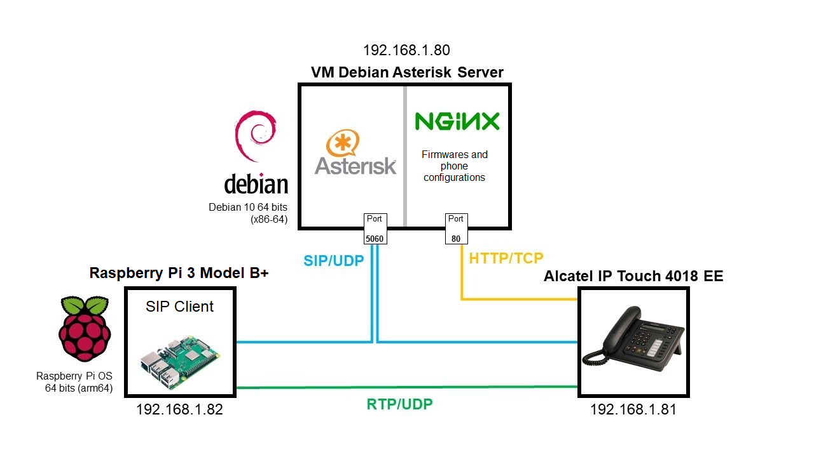

 

 
 

# Setting up a VoIP communication between a Raspberry Pi and an IP phone using an Asterisk IP PBX server

Student project carried out as part of studies at the University of Technology of Compiègne (UTC) 
**Guillaume Nibert  
Supervisor: [Dr. Ahmed Lounis](https://www.hds.utc.fr/~lounisah/dokuwiki/)**

 

 

---

English article: https://guillaume.nibert.fr/voip-asterisk-rpi-ipphone-project/ 
English PDF report: <a href="https://github.com/guillaumenibert/VoIP-Asterisk-WebRTC-SIP/raw/main/PDF/en/TZ%20-%20Guillaume%20Nibert%20-%20Report%20-%20Setting%20up%20a%20VoIP%20communication%20between%20a%20Raspberry%20Pi%20and%20an%20IP%20phone.pdf" download target="_blank">Download</a> 
English PDF presentation material: <a href="https://github.com/guillaumenibert/VoIP-Asterisk-WebRTC-SIP/raw/main/PDF/en/TZ%20-%20Guillaume%20Nibert%20-%20Presentation%20-%20Setting%20up%20a%20VoIP%20communication%20between%20a%20Raspberry%20Pi%20and%20an%20IP%20phone.pdf" download target="_blank">Download</a>  

French article: https://guillaume.nibert.fr/fr/voip-asterisk-rpi-ipphone-projet/ 
French PDF report: <a href="https://github.com/guillaumenibert/VoIP-Asterisk-WebRTC-SIP/raw/main/PDF/fr/TZ%20-%20Guillaume%20Nibert%20-%20Rapport%20-%20Mise%20en%20place%20d'une%20communication%20entre%20un%20Raspberry%20Pi%20et%20un%20t%C3%A9l%C3%A9phone%20IP.pdf" download target="_blank">Download</a> 
French PDF presentation material: <a href="https://github.com/guillaumenibert/VoIP-Asterisk-WebRTC-SIP/raw/main/PDF/fr/TZ%20-%20Guillaume%20Nibert%20-%20Pr%C3%A9sentation%20-%20Mise%20en%20place%20d'une%20communication%20entre%20un%20Raspberry%20Pi%20et%20un%20t%C3%A9l%C3%A9phone%20IP.pdf" download target="_blank">Download</a> 

 

## Context

Telegraph, analogue telephone, digital telephone, IP telephone with wired or wireless modes, telephony is currently a widely used and very convenient global link, indispensable for fast and real-time exchanges, for all purposes. It is quite reliable, not too expensive, and offers ever more extensive possibilities at an ever faster rate. 

The aim of this project is to use the IP protocol used in the Internet, to make devices communicate with each other (commonly called endpoints). This project will therefore implement two endpoints with the following hardware characteristics:
    <ul style="text-align: justify">
        <li>endpoint 1: Alcatel IP Touch 4018 EE phone;</li>
        <li>endpoint 2: Raspberry Pi 3 Model B+.</li>
    </ul>

    Below is a global diagram of the infrastructure architecture in the <b>192.168.1.0</b> network <i>(the router is not shown for readability reasons)</i>:

*(Figure 1 - Overall infrastructure diagram)*

Simply, without going into detail, in this diagram there are two clients: the end points which are the <i>Alcatel IP Touch 4018 EE</i> and the <i>Raspberry Pi</i>. When there is a telephone communication between these two devices, the protocol used for the initiation of the communication is SIP <i>(Session Initiation Protocol)</i> for the application layer and UDP for the transport layer of the Internet protocol stack. This initiation goes through an intermediary: the SIP initiation server (Asterisk) which is accessible on the Debian Asterisk Server virtual machine on port 5060 <b><i>(in blue)</i></b>. Once the initiation is done, the two devices connect to each other directly to let the audio pass via the RTP protocol <b><i>(in green)</i></b>.

An important point concerns the Alcatel phone part, which needs at each startup to check its firmware and configuration files allowing it to connect to the Asterisk server. These files are stored in the Debian virtual machine and are available to the Alcatel via the HTTP server on port 80 <b><i>(in orange)</i></b>.

This project details the architecture of the system as well as the implementation of the entire IP telephony infrastructure allowing communication between these two devices. Firstly, some theoretical elements on the protocols used will be looked at, in particular on the role and functioning of SIP in VoIP and RTP. Secondly, the interest of using the Asterisk system in the design of this infrastructure and its implementation will be evaluated, then the two clients (Raspberry Pi and Alcatel phone) will be configured and tested. Finally a user-friendly SIP client in JavaScript for the Raspberry Pi will be designed.

## [1. SIP protocol and VoIP communication](1_sip_voip.md)

## [2. Implementation of an Asterisk IP PBX server](2_ipbx_asterisk.md)

## [3. Installation and configuration of a SIP client on the Raspberry Pi](3_install_client_sip_rpi.md)

## [4. IP phone configuration](4_config_alcatel.md)

## [5. Communication tests](5_tests_com_sip.md)

## [6. JavaScript SIP client using WebRTC](6_sip_webrtc.md)

## [Conclusion](Conclusion.md)

## [Abbreviations](Abbreviations.md)

## [References](References.md)

## [Other licenses](licenses.md)